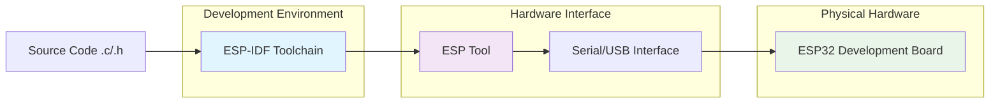
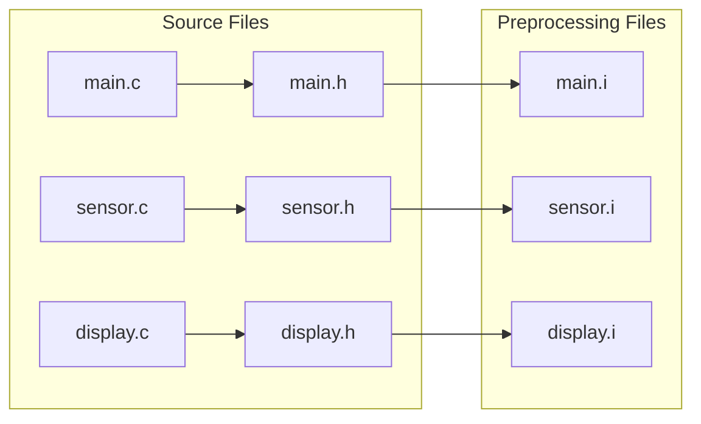
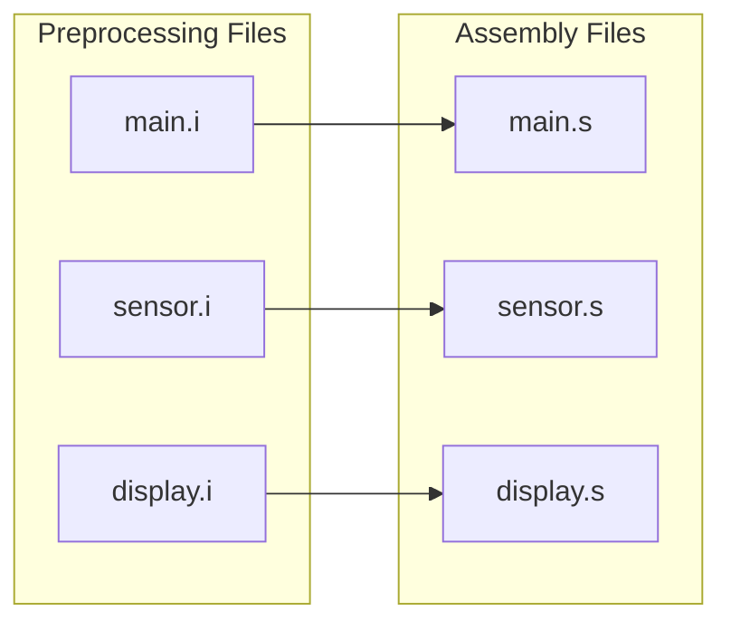
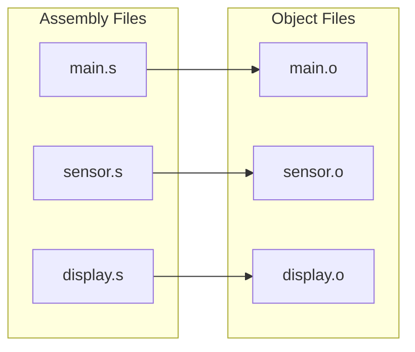
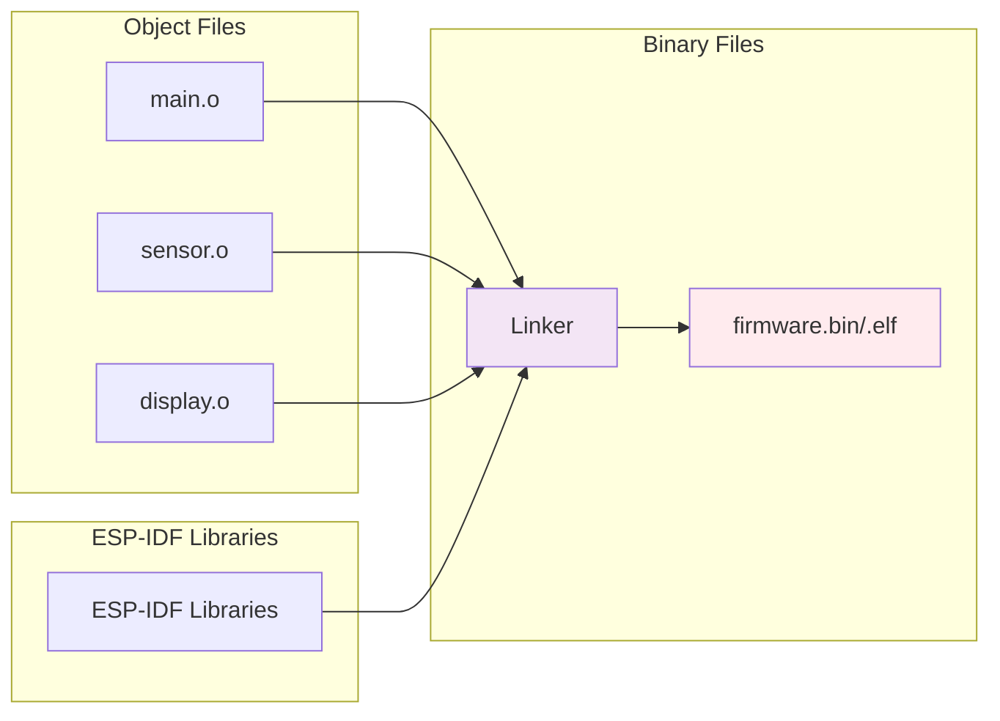
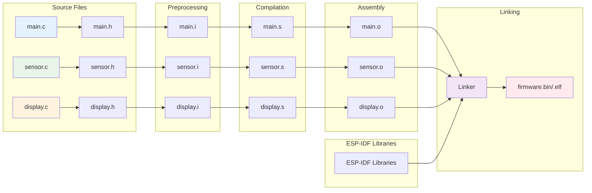
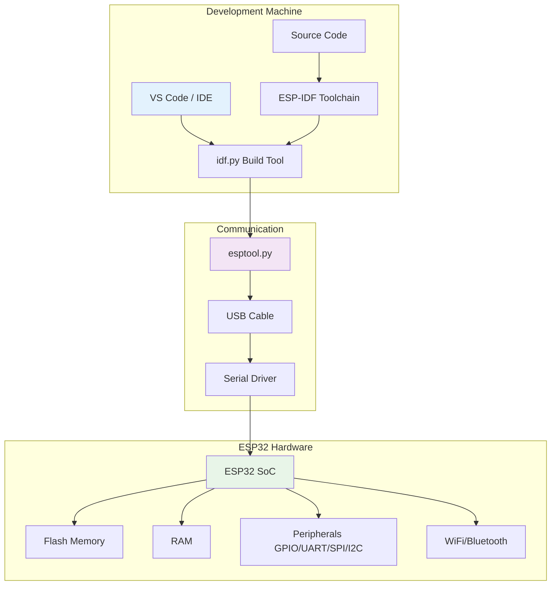
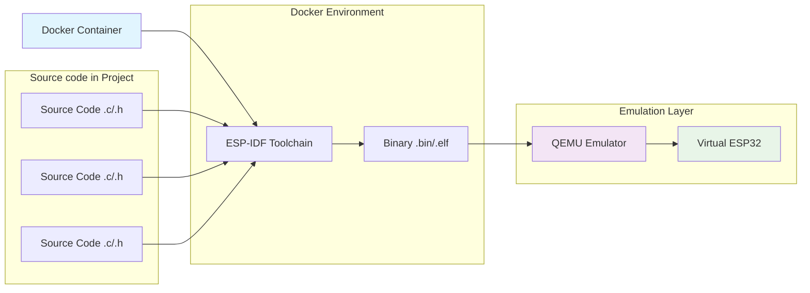
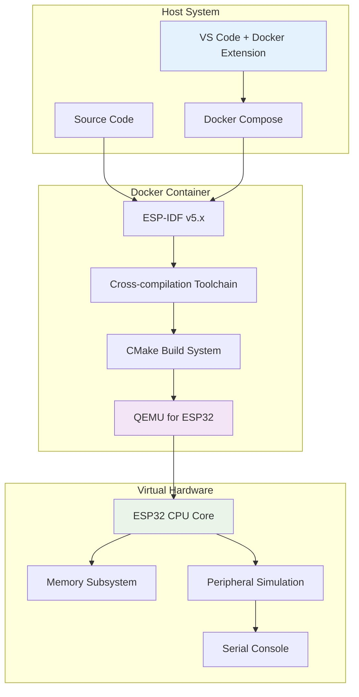

# ระบบการ Build สำหรับ ESP32 Project 

## บทนำ

การพัฒนา Firmware สำหรับ ESP32 ด้วยภาษา C ต้องอาศัยระบบ Build ที่มีประสิทธิภาพ ESP-IDF (Espressif IoT Development Framework) ใช้ CMake เป็น Build System หลัก ซึ่งช่วยจัดการการ compile, link และ deploy code ไปยัง ESP32 development board

## ภาพรวมของ ESP-IDF Build System 

### การทำงานของ Build System 

### ภาพรวมของกระบวนการพัฒนา ESP32 Hardware

ในการพัฒนา firmware สำหรับ ESP32 มีขั้นตอนหลักดังนี้:

1. **การเขียน Source Code**: Developer เขียน source code ในภาษา C/C++ ประกอบด้วยไฟล์ `.c` และ `.h` ที่มีฟังก์ชันต่างๆ สำหรับควบคุม hardware components เช่น GPIO, ADC, UART, WiFi, และ sensors

2. **ระบบ Build Process**: Source code จะถูกนำเข้าสู่ ESP-IDF Build System ซึ่งใช้ CMake ในการจัดการกระบวนการ compilation, linking, และการสร้างไฟล์ binary (.bin/.elf) ที่พร้อมใช้งาน

3. **Hardware Interface**: ไฟล์ binary ที่ได้จากขั้นตอน build จะถูกส่งผ่าน hardware interface (USB-to-Serial converter) โดยใช้เครื่องมือ esptool.py เพื่อเขียนลงใน flash memory ของ ESP32 development board

4. **Deployment & Testing**: หลังจากการ flash เสร็จสิ้น ESP32 จะสามารถทำงานตาม firmware ที่เขียนไว้ และ developer สามารถ monitor การทำงานผ่าน serial communication

## กระบวนการ Build ของ ESP32 toolchain

### ขั้นตอนที่ 1: Preprocessing (การประมวลผลเบื้องต้น)
- **Input**: Source files (.c) + Header files (.h)
- **Process**: 
  - รวม `#include` directives (นำเนื้อหาจาก .h มาใส่ใน .c)
  - ประมวลผล `#define` macros
  - จัดการ conditional compilation (`#ifdef`, `#ifndef`)
  - ลบ comments ออกจากโค้ด
- **Output**: Preprocessed files (.i) - ไฟล์ C ที่ผ่านการประมวลผลแล้ว
- **ตัวอย่าง**: `main.c` + `main.h` → `main.i`

โดยทั่วไป ในโปรเจคของ ESP32 มักจะเขียน souce code ที่รับผิดชอบงานต่างๆ แยกกัน ดังนั้นในขั้นตอนที่ 1 จะมีการประมวลผลเบื้องต้นขนานกันไปในแต่ละ source code

ถ้าโปรเจคเรามี source code  และ include เป็นจำนวนมาก ก็ต้องทำจนครบทุกไฟล์

### ขั้นตอนที่ 2: Compilation (การคอมไพล์)
- **Input**: Preprocessed files (.i)
- **Process**:
  - แปลง C syntax เป็น Assembly language
  - ตรวจสอบ syntax errors
  - ปรับแต่งโค้ดตาม optimization flags
  - สร้าง symbol table
- **Output**: Assembly files (.s) - โค้ดภาษา Assembly
- **ตัวอย่าง**: `main.i` → `main.s`

### ขั้นตอนที่ 3: Assembly (การแปลงเป็นรหัสเครื่อง)
- **Input**: Assembly files (.s)
- **Process**:
  - แปลง Assembly instructions เป็น Machine code
  - สร้าง Object code พร้อม relocation information
  - สร้าง symbol references สำหรับ external functions
- **Output**: Object files (.o) - Machine code ที่ยังไม่ได้ link
- **ตัวอย่าง**: `main.s` → `main.o`

### ขั้นตอนที่ 4: Linking (การเชื่อมโยง)
- **Input**: Object files (.o) + ESP-IDF Libraries + System libraries
- **Process**:
  - รวม Object files ทั้งหมดเข้าด้วยกัน
  - แก้ไข symbol references (function calls ระหว่างไฟล์)
  - จัดระเบียบ memory layout
  - เพิ่ม ESP32 bootloader และ partition information
- **Output**: Executable binary (.bin/.elf) - Firmware พร้อมใช้งาน
- **ตัวอย่าง**: `main.o` + `sensor.o` + `display.o` + ESP-IDF libs → `firmware.bin`

### สรุปการไหลของข้อมูลในกระบวนการ Build:

### ESP32 Development Board และ Toolchain

**ESP-IDF Toolchain (Software)** ได้จัดเตรียมเครื่องมือต่อไปนี้ไว้ให้ตอนติดตั้งโปรแกรม (หรือติดตั้งผ่าน docker)
- Cross-compilation tools สำหรับ Xtensa architecture
- Build system และ configuration tools
- Flash programming utilities
- Debugging และ monitoring tools

**Hardware Interface** 
- USB-to-Serial converter (CP2102, FTDI, CH340)

- Hardware debugging (JTAG)

### Build Process Flow สำหรับ Hardware Development

รายละเอียดของแต่ละขั้นตอนในกระบวนการ Build:

1. **🔧 Environment Setup**: ติดตั้ง ESP-IDF และ toolchain
   - 📦 ติดตั้ง ESP-IDF framework พร้อม dependencies
   - ⚙️ ติดตั้ง cross-compiler toolchain สำหรับ ESP32 (xtensa-esp32-elf-gcc)
   - 🌐 ตั้งค่า environment variables (IDF_PATH, PATH)
   - 🐍 ติดตั้ง Python packages ที่จำเป็น (esptool, idf-tools)

2. **📋 Configuration Phase**: อ่านค่า config จาก sdkconfig
   - 📄 โหลดการตั้งค่าจาก sdkconfig.defaults หรือ sdkconfig
   - 🔌 กำหนดค่า hardware-specific settings (GPIO pins, clock frequency, flash size)
   - ✅ เลือก components ที่จะ enable/disable
   - 🗺️ ตั้งค่า memory layout และ partition table

3. **🔍 Component Discovery**: ค้นหา components ที่ต้องใช้
   - 📁 ค้นหา components ใน ESP-IDF framework (/components)
   - 🏗️ ค้นหา custom components ใน project (/components)
   - 🌐 ค้นหา managed components จาก ESP Component Registry
   - 🌳 สร้าง dependency tree ของ components

4. **🔗 Dependency Resolution**: แก้ไข dependencies ระหว่าง components
   - 🔍 วิเคราะห์ REQUIRES และ PRIV_REQUIRES ใน CMakeLists.txt
   - 📊 จัดลำดับ compilation ตาม dependency chain
   - 🔄 ตรวจสอบ circular dependencies
   - 📂 เตรียม include paths และ library paths

5. **⚡ Cross-Compilation**: compile source files เป็น object files สำหรับ ESP32
   - 🛠️ ใช้ xtensa-esp32-elf-gcc compiler สำหรับ ESP32 architecture
   - 🔄 แปลง .c/.cpp files เป็น .o files (machine code)
   - 🚀 ใช้ optimization flags (-O2, -Os) ตาม configuration
   - 🐛 สร้าง debug symbols หาก enabled

6. **🔗 Linking**: รวม object files เป็น executable
   - 📦 รวม object files (.o) ทั้งหมดด้วย xtensa-esp32-elf-ld linker
   - 📚 เชื่อมโยง ESP-IDF libraries (libfreertos.a, libdriver.a, etc.)
   - 🗺️ จัดระเบียบ memory layout ตาม linker script
   - 🔧 แก้ไข symbol references ระหว่าง components

7. **💾 Binary Generation**: สร้าง firmware binary files
   - 📱 สร้าง .elf file (executable with debug info)
   - 🔄 แปลง .elf เป็น .bin file (raw binary)
   - 🚀 สร้าง bootloader.bin และ partition-table.bin
   - 🔐 คำนวณ checksums และ digital signatures

8. **⬇️ Flash Programming**: เขียน binary ลง ESP32 flash memory
   - 🛠️ ใช้ esptool.py เพื่อติดต่อกับ ESP32 ผ่าน serial port
   - 🚀 เขียน bootloader ลง address 0x1000
   - 📋 เขียน partition table ลง address 0x8000
   - 📱 เขียน application binary ลง address 0x10000

9. **📺 Serial Monitoring**: ติดตาม output ผ่าน serial port
   - 🔌 เชื่อมต่อกับ ESP32 ผ่าน UART/USB interface
   - 📝 รับและแสดง log messages จาก ESP_LOG functions
   - 🔍 ตรวจสอบ system startup และ runtime behavior
   - 🐛 Debug และ troubleshoot issues

## สถาปัตยกรรม Development Environment

# ระบบการ Build สำหรับ ESP32 Project ด้วย Docker และ QEMU

การพัฒนา Firmware สำหรับ ESP32 ด้วยภาษา C สามารถทำได้โดยไม่ต้องมี hardware จริง โดยใช้ ESP-IDF (Espressif IoT Development Framework) ร่วมกับ Docker และ QEMU Emulator เพื่อจำลองการทำงานของ ESP32 ระบบนี้ใช้ CMake เป็น Build System หลัก ซึ่งช่วยจัดการการ compile, link และ test code ใน environment ที่จำลองขึ้น

## ภาพรวมของ ESP-IDF Build System ด้วย Docker และ QEMU

### การทำงานของ Build System ในสภาพแวดล้อมจำลอง

### การทำงานร่วมกันระหว่าง Docker และ QEMU

**Docker Container** มีหน้าที่จัดเตรียม
- ESP-IDF development environment
- Cross-compilation toolchain
- Build tools และ dependencies
- Consistent development environment

**QEMU Emulator** มีหน้าที่จัดเตรียม
- Virtual ESP32 hardware
- Peripheral simulation
- Serial output monitoring
- Debugging capabilities

### Build Process Flow สำหรับ Docker + QEMU
1. **Docker Setup**: เตรียม container ด้วย ESP-IDF environment
2. **Configuration Phase**: อ่านค่า config จาก sdkconfig
3. **Component Discovery**: ค้นหา components ที่ต้องใช้
4. **Dependency Resolution**: แก้ไข dependencies ระหว่าง components
5. **Cross-Compilation**: compile source files เป็น object files สำหรับ ESP32
6. **Linking**: รวม object files เป็น executable
7. **Binary Generation**: สร้าง firmware binary files
8. **QEMU Execution**: รัน binary ใน QEMU emulator
9. **Testing & Debugging**: ทดสอบและ debug ผ่าน virtual environment

## สถาปัตยกรรม Development Environment

