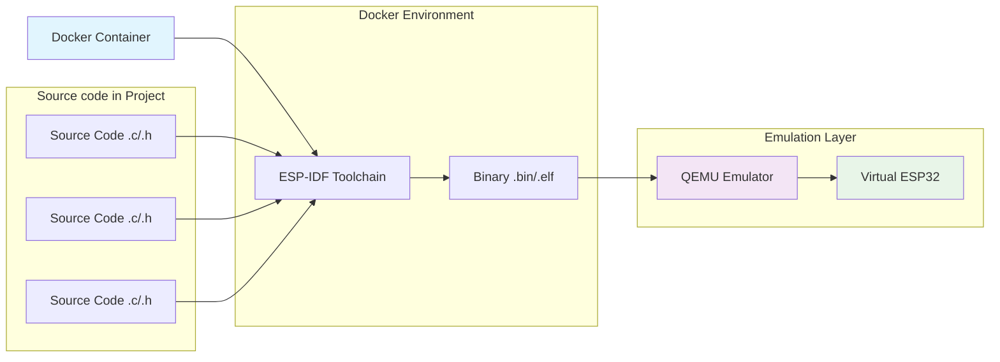
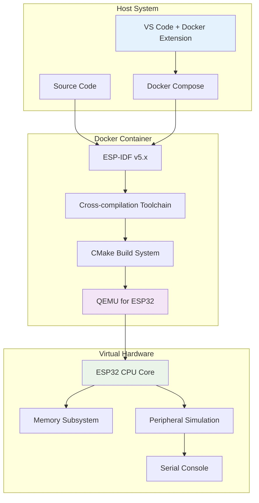

# ระบบการ Build สำหรับ ESP32 Project ด้วย Docker และ QEMU

## บทนำ

การพัฒนา Firmware สำหรับ ESP32 ด้วยภาษา C สามารถทำได้โดยไม่ต้องมี hardware จริง โดยใช้ ESP-IDF (Espressif IoT Development Framework) ร่วมกับ Docker และ QEMU Emulator เพื่อจำลองการทำงานของ ESP32 ระบบนี้ใช้ CMake เป็น Build System หลัก ซึ่งช่วยจัดการการ compile, link และ test code ใน environment ที่จำลองขึ้น

## ภาพรวมของ ESP-IDF Build System ด้วย Docker และ QEMU

### การทำงานของ Build System ในสภาพแวดล้อมจำลอง



### การทำงานร่วมกันระหว่าง Docker และ QEMU

**Docker Container** มีหน้าที่จัดเตรียม
- ESP-IDF development environment
- Cross-compilation toolchain
- Build tools และ dependencies
- Consistent development environment

**QEMU Emulator** มีหน้าที่จัดเตรียม
- Virtual ESP32 hardware
- Peripheral simulation
- Serial output monitoring
- Debugging capabilities


### Build Process Flow สำหรับ Docker + QEMU
1. **Docker Setup**: เตรียม container ด้วย ESP-IDF environment
2. **Configuration Phase**: อ่านค่า config จาก sdkconfig
3. **Component Discovery**: ค้นหา components ที่ต้องใช้
4. **Dependency Resolution**: แก้ไข dependencies ระหว่าง components
5. **Cross-Compilation**: compile source files เป็น object files สำหรับ ESP32
6. **Linking**: รวม object files เป็น executable
7. **Binary Generation**: สร้าง firmware binary files
8. **QEMU Execution**: รัน binary ใน QEMU emulator
9. **Testing & Debugging**: ทดสอบและ debug ผ่าน virtual environment

## สถาปัตยกรรม Development Environment



## โครงสร้าง Project สำหรับ Docker Development

### Project Structure มาตรฐาน

```
my_esp32_project/
├── docker-compose.yml          # Docker services configuration
├── Dockerfile                  # ESP-IDF container definition
├── .devcontainer/             # VS Code dev container config
│   └── devcontainer.json
├── CMakeLists.txt              # Top-level CMake file
├── sdkconfig                   # Project configuration
├── main/                       # Main application
│   ├── CMakeLists.txt         # Main component CMake
│   ├── main.c                 # Entry point
│   └── include/               # Private headers
│       └── main.h
├── components/                 # Custom components
│   └── my_component/
│       ├── CMakeLists.txt
│       ├── my_component.c
│       └── include/
│           └── my_component.h
├── build/                      # Build output (auto-generated)
├── qemu_logs/                  # QEMU execution logs
└── scripts/                    # Helper scripts
    ├── build.sh
    ├── run-qemu.sh
    └── monitor.sh
```

### Docker Configuration Files

#### docker-compose.yml
```yaml
version: '3.8'

services:
  esp-idf:
    build: .
    volumes:
      - .:/workspace
      - esp-idf-cache:/root/.espressif
    working_dir: /workspace
    environment:
      - IDF_PATH=/opt/esp/idf
      - IDF_TOOLS_PATH=/opt/esp
    ports:
      - "5555:5555"  # QEMU monitor
      - "9999:9999"  # GDB server
    privileged: true
    stdin_open: true
    tty: true
    command: /bin/bash

volumes:
  esp-idf-cache:
```

#### Dockerfile
```dockerfile
FROM espressif/idf:v5.1

# Install additional tools for QEMU and development
RUN apt-get update && apt-get install -y \
    qemu-system-xtensa \
    gdb-multiarch \
    screen \
    vim \
    && rm -rf /var/lib/apt/lists/*

# Set up QEMU for ESP32
RUN mkdir -p /opt/qemu

# Copy custom QEMU configuration if needed
COPY qemu-config/ /opt/qemu/

WORKDIR /workspace

# Set up environment
ENV QEMU_ESP32=/usr/bin/qemu-system-xtensa
ENV QEMU_BIOS_DIR=/opt/qemu

CMD ["/bin/bash"]
```

#### .devcontainer/devcontainer.json
```json
{
    "name": "ESP32 Development",
    "dockerComposeFile": "../docker-compose.yml",
    "service": "esp-idf",
    "workspaceFolder": "/workspace",
    "customizations": {
        "vscode": {
            "extensions": [
                "ms-vscode.cpptools",
                "espressif.esp-idf-extension",
                "ms-python.python"
            ],
            "settings": {
                "terminal.integrated.defaultProfile.linux": "bash",
                "C_Cpp.intelliSenseEngine": "Default"
            }
        }
    },
    "postCreateCommand": "echo 'ESP-IDF Development Environment Ready!'",
    "remoteUser": "root"
}
```

### ไฟล์สำคัญในระบบ Build และ Emulation

#### 1. Top-level CMakeLists.txt
```cmake
# ตั้งค่า minimum CMake version
cmake_minimum_required(VERSION 3.16)

# Include ESP-IDF build system
include($ENV{IDF_PATH}/tools/cmake/project.cmake)

# กำหนดชื่อ project
project(my_esp32_project)

# เพิ่ม QEMU-specific configurations
if(CONFIG_ESP32_QEMU)
    message(STATUS "Building for QEMU emulation")
    add_compile_definitions(ESP32_QEMU=1)
endif()
```

#### 2. main/CMakeLists.txt
```cmake
# สร้าง component สำหรับ main application
idf_component_register(
    SRCS "main.c" "app_functions.c"
    INCLUDE_DIRS "include"
    REQUIRES driver esp_wifi nvs_flash
)

# เพิ่ม QEMU-specific code
target_compile_definitions(${COMPONENT_LIB} PRIVATE
    QEMU_BUILD=1
)
```

#### 3. sdkconfig.qemu (QEMU-specific configuration)
```
# QEMU-specific settings
CONFIG_ESP32_QEMU=y
CONFIG_ESP_SYSTEM_PANIC_PRINT_HALT=y
CONFIG_ESP_INT_WDT=n
CONFIG_ESP_TASK_WDT=n

# Serial console for QEMU
CONFIG_ESP_CONSOLE_UART_DEFAULT=y
CONFIG_ESP_CONSOLE_UART_NUM=0
CONFIG_ESP_CONSOLE_UART_BAUDRATE_115200=y

# Memory settings for emulation
CONFIG_ESP32_SPIRAM_SUPPORT=n
CONFIG_SPIRAM=n

# Disable hardware-specific features
CONFIG_ESP32_PHY_CALIBRATION_AND_DATA_STORAGE=n
CONFIG_ESP32_WIFI_STATIC_RX_BUFFER_NUM=4
CONFIG_ESP32_WIFI_DYNAMIC_RX_BUFFER_NUM=8
```

#### 4. scripts/run-qemu.sh
```bash
#!/bin/bash

# QEMU ESP32 run script
PROJECT_NAME=${1:-my_esp32_project}
BUILD_DIR="build"

echo "Starting QEMU ESP32 emulation for $PROJECT_NAME"

# Check if binary exists
if [ ! -f "$BUILD_DIR/$PROJECT_NAME.elf" ]; then
    echo "Error: Binary not found. Please build first."
    exit 1
fi

# Run QEMU with ESP32 configuration
qemu-system-xtensa \
    -nographic \
    -machine esp32 \
    -drive file="$BUILD_DIR/$PROJECT_NAME.bin",if=mtd,format=raw \
    -serial stdio \
    -monitor telnet:localhost:5555,server,nowait \
    -gdb tcp::9999 \
    "$@"
```

#### 5. scripts/build.sh
```bash
#!/bin/bash

echo "Building ESP32 project in Docker..."

# Use QEMU-specific config
cp sdkconfig.qemu sdkconfig

# Clean and build
idf.py fullclean
idf.py build

echo "Build completed. Binary ready for QEMU."
```

## Docker และ QEMU Commands

### การเริ่มต้น Development Environment

```bash
# สร้างและเริ่ม Docker container
docker-compose up -d

# เข้าสู่ container
docker-compose exec esp-idf bash

# หรือใช้ VS Code Dev Container (แนะนำ)
# 1. เปิด VS Code
# 2. ติดตั้ง Dev Containers extension
# 3. เปิด Command Palette (Ctrl+Shift+P)
# 4. เลือก "Dev Containers: Reopen in Container"
```

### คำสั่ง Build และ Emulation พื้นฐาน

```bash
# Configure project สำหรับ QEMU
idf.py -D SDKCONFIG_DEFAULTS=sdkconfig.qemu reconfigure

# Build project
idf.py build

# รัน QEMU emulation
./scripts/run-qemu.sh my_project

# Build และรัน QEMU แบบรวด
./scripts/build.sh && ./scripts/run-qemu.sh my_project

# Monitor QEMU console (terminal แยก)
telnet localhost 5555
```

### การใช้งาน QEMU ขั้นสูง

```bash
# รัน QEMU พร้อม debugging
qemu-system-xtensa \
    -nographic \
    -machine esp32 \
    -drive file=build/my_project.bin,if=mtd,format=raw \
    -serial stdio \
    -gdb tcp::9999 \
    -S  # รอ debugger connection

# เชื่อมต่อ GDB (terminal ใหม่)
xtensa-esp32-elf-gdb build/my_project.elf
(gdb) target remote localhost:9999
(gdb) continue

# ดู QEMU monitor commands
# ใน QEMU monitor (telnet localhost 5555):
# help                    - แสดง commands ทั้งหมด
# info registers         - แสดง CPU registers
# info mtree             - แสดง memory layout
# quit                   - ออกจาก QEMU
```

### Build Targets เฉพาะ QEMU

```bash
# Build สำหรับ QEMU โดยเฉพาะ
idf.py -D CONFIG_ESP32_QEMU=y build

# สร้าง binary format ที่เหมาะกับ QEMU
idf.py build
esptool.py --chip esp32 elf2image build/my_project.elf

# ตรวจสอบขนาด binary
idf.py size

# Clean build สำหรับ QEMU
idf.py fullclean
rm -rf build/
rm -f sdkconfig
```

## CMake Configuration สำหรับ QEMU Development

### การสร้าง QEMU-Compatible Component

#### components/sensor/CMakeLists.txt
```cmake
# กำหนด source files และ dependencies
idf_component_register(
    SRCS 
        "sensor.c"
        "sensor_calibration.c"
        $<$<BOOL:${CONFIG_ESP32_QEMU}>:sensor_qemu_mock.c>
    INCLUDE_DIRS 
        "include"
    PRIV_INCLUDE_DIRS
        "private_include"
    REQUIRES 
        driver      # Public dependency
        esp_common
    PRIV_REQUIRES
        json        # Private dependency
)

# เพิ่ม QEMU-specific definitions
if(CONFIG_ESP32_QEMU)
    target_compile_definitions(${COMPONENT_LIB} PRIVATE
        SENSOR_VERSION_MAJOR=1
        SENSOR_VERSION_MINOR=0
        QEMU_SIMULATION=1
    )
else()
    target_compile_definitions(${COMPONENT_LIB} PRIVATE
        SENSOR_VERSION_MAJOR=1
        SENSOR_VERSION_MINOR=0
        HARDWARE_BUILD=1
    )
endif()

# เพิ่ม compiler flags
target_compile_options(${COMPONENT_LIB} PRIVATE
    -Wall
    -Wextra
    -O2
)
```

#### components/sensor/include/sensor.h
```c
#ifndef SENSOR_H
#define SENSOR_H

#include "esp_err.h"
#include "sdkconfig.h"

#ifdef __cplusplus
extern "C" {
#endif

/**
 * @brief Initialize sensor (QEMU-compatible)
 * @return ESP_OK on success
 */
esp_err_t sensor_init(void);

/**
 * @brief Read sensor value (simulated in QEMU)
 * @param value Pointer to store sensor value
 * @return ESP_OK on success
 */
esp_err_t sensor_read(float *value);

#ifdef CONFIG_ESP32_QEMU
/**
 * @brief Set mock sensor value for QEMU testing
 * @param mock_value Value to return from sensor_read()
 */
void sensor_set_mock_value(float mock_value);
#endif

#ifdef __cplusplus
}
#endif

#endif // SENSOR_H
```

#### components/sensor/sensor.c
```c
#include "sensor.h"
#include "esp_log.h"
#include "sdkconfig.h"

#ifdef CONFIG_ESP32_QEMU
    #include "esp_random.h"  // For mock data
#else
    #include "driver/adc.h"  // Real hardware
#endif

static const char *TAG = "SENSOR";

#ifdef CONFIG_ESP32_QEMU
static float mock_sensor_value = 2.5f;  // Default mock value
#endif

esp_err_t sensor_init(void)
{
    ESP_LOGI(TAG, "Initializing sensor component v%d.%d", 
             SENSOR_VERSION_MAJOR, SENSOR_VERSION_MINOR);
    
#ifdef CONFIG_ESP32_QEMU
    ESP_LOGI(TAG, "Running in QEMU simulation mode");
    // No real hardware initialization needed
#else
    ESP_LOGI(TAG, "Running on real hardware");
    // Configure ADC for real hardware
    adc1_config_width(ADC_WIDTH_BIT_12);
    adc1_config_channel_atten(ADC1_CHANNEL_0, ADC_ATTEN_DB_11);
#endif
    
    return ESP_OK;
}

esp_err_t sensor_read(float *value)
{
    if (value == NULL) {
        return ESP_ERR_INVALID_ARG;
    }
    
#ifdef CONFIG_ESP32_QEMU
    // Simulate sensor reading with some variation
    uint32_t random_val = esp_random();
    float variation = (float)(random_val % 100) / 1000.0f; // 0-0.1V variation
    *value = mock_sensor_value + variation;
    
    ESP_LOGD(TAG, "QEMU simulated sensor value: %.3f V", *value);
#else
    // Real hardware ADC reading
    int raw_value = adc1_get_raw(ADC1_CHANNEL_0);
    *value = (float)raw_value * 3.3f / 4095.0f; // Convert to voltage
    
    ESP_LOGD(TAG, "Hardware sensor raw: %d, voltage: %.2f V", raw_value, *value);
#endif
    
    return ESP_OK;
}

#ifdef CONFIG_ESP32_QEMU
void sensor_set_mock_value(float mock_value)
{
    mock_sensor_value = mock_value;
    ESP_LOGI(TAG, "Mock sensor value set to: %.3f V", mock_value);
}
#endif
```

#### components/sensor/sensor_qemu_mock.c (QEMU-only file)
```c
#include "sensor.h"
#include "esp_log.h"
#include "freertos/FreeRTOS.h"
#include "freertos/task.h"

static const char *TAG = "SENSOR_QEMU";

/**
 * @brief QEMU-specific sensor simulation task
 */
void sensor_simulation_task(void *pvParameters)
{
    float sim_values[] = {1.0f, 1.5f, 2.0f, 2.5f, 3.0f};
    int value_index = 0;
    
    while (1) {
        // Cycle through different mock values every 10 seconds
        sensor_set_mock_value(sim_values[value_index]);
        value_index = (value_index + 1) % (sizeof(sim_values) / sizeof(sim_values[0]));
        
        ESP_LOGI(TAG, "QEMU sensor simulation updated");
        vTaskDelay(pdMS_TO_TICKS(10000)); // 10 seconds
    }
}

/**
 * @brief Start QEMU sensor simulation
 */
esp_err_t sensor_start_qemu_simulation(void)
{
    xTaskCreate(sensor_simulation_task, "sensor_sim", 2048, NULL, 5, NULL);
    ESP_LOGI(TAG, "QEMU sensor simulation started");
    return ESP_OK;
}
```

## Configuration Management สำหรับ QEMU

### การใช้งาน menuconfig ใน Docker

```bash
# เข้าสู่ Docker container
docker-compose exec esp-idf bash

# เปิด menuconfig GUI
idf.py menuconfig

# บันทึก config เป็น QEMU default
idf.py save-defconfig --defaults sdkconfig.qemu

# ใช้ QEMU config
idf.py -D SDKCONFIG_DEFAULTS=sdkconfig.qemu reconfigure
```

### การสร้าง QEMU-Specific Kconfig

#### components/sensor/Kconfig
```kconfig
menu "Sensor Configuration"

    config SENSOR_ENABLE_CALIBRATION
        bool "Enable sensor calibration"
        default y if !ESP32_QEMU
        default n if ESP32_QEMU
        help
            Enable automatic sensor calibration on startup.
            Disabled in QEMU as no real hardware is present.

    config SENSOR_SAMPLE_RATE
        int "Sensor sampling rate (Hz)"
        range 1 1000
        default 10
        help
            Set the sensor sampling rate in Hz.

    choice SENSOR_PRECISION
        prompt "Sensor precision"
        default SENSOR_PRECISION_MEDIUM
        help
            Select sensor precision level.

        config SENSOR_PRECISION_LOW
            bool "Low precision (8-bit)"
        config SENSOR_PRECISION_MEDIUM
            bool "Medium precision (10-bit)"
        config SENSOR_PRECISION_HIGH
            bool "High precision (12-bit)"
    endchoice

    config SENSOR_QEMU_MOCK_ENABLED
        bool "Enable QEMU sensor mocking"
        depends on ESP32_QEMU
        default y
        help
            Enable mock sensor data for QEMU simulation.

    config SENSOR_DEBUG
        bool "Enable sensor debug output"
        default y if ESP32_QEMU
        default n
        help
            Enable debug logging for sensor component.
            Automatically enabled in QEMU for testing.

endmenu
```

### การใช้ Config ในโค้ด QEMU-aware

```c
#include "sdkconfig.h"

void sensor_configure(void)
{
    #ifdef CONFIG_SENSOR_ENABLE_CALIBRATION
        #ifndef CONFIG_ESP32_QEMU
            sensor_calibrate();  // Only on real hardware
        #else
            ESP_LOGI("SENSOR", "Skipping calibration in QEMU");
        #endif
    #endif
    
    int sample_rate = CONFIG_SENSOR_SAMPLE_RATE;
    
    #ifdef CONFIG_ESP32_QEMU
        // QEMU-specific configuration
        ESP_LOGI("SENSOR", "Configuring for QEMU simulation");
        #ifdef CONFIG_SENSOR_QEMU_MOCK_ENABLED
            sensor_start_qemu_simulation();
        #endif
    #else
        // Real hardware configuration
        #ifdef CONFIG_SENSOR_PRECISION_HIGH
            adc1_config_width(ADC_WIDTH_BIT_12);
        #elif defined(CONFIG_SENSOR_PRECISION_MEDIUM)
            adc1_config_width(ADC_WIDTH_BIT_10);
        #else
            adc1_config_width(ADC_WIDTH_BIT_8);
        #endif
    #endif
}
```

## Debugging และ Testing ใน QEMU Environment

### การใช้งาน GDB กับ QEMU

```bash
# Terminal 1: เริ่ม QEMU พร้อม GDB server
qemu-system-xtensa \
    -nographic \
    -machine esp32 \
    -drive file=build/my_project.bin,if=mtd,format=raw \
    -serial stdio \
    -gdb tcp::9999 \
    -S  # หยุดรอ debugger

# Terminal 2: เชื่อมต่อ GDB
docker-compose exec esp-idf bash
xtensa-esp32-elf-gdb build/my_project.elf

# GDB commands
(gdb) target remote localhost:9999
(gdb) break app_main
(gdb) continue
(gdb) info registers
(gdb) backtrace
(gdb) print variable_name
(gdb) step
(gdb) next
```

### การ Monitor และ Log Analysis

```bash
# Monitor QEMU console output
./scripts/run-qemu.sh my_project | tee qemu_logs/run_$(date +%Y%m%d_%H%M%S).log

# ใช้ QEMU monitor สำหรับ advanced debugging
telnet localhost 5555

# QEMU monitor commands:
# (qemu) info registers      - ดู CPU registers
# (qemu) info mem            - ดู memory mapping
# (qemu) info mtree          - ดู memory tree
# (qemu) x/10i $pc           - disassemble ที่ program counter
# (qemu) x/10x 0x3fff0000    - dump memory
# (qemu) cont                - continue execution
# (qemu) stop                - stop execution
```

### การทดสอบ Unit Test ใน QEMU

#### test/test_sensor.c
```c
#include "unity.h"
#include "sensor.h"
#include "esp_log.h"

static const char *TAG = "TEST_SENSOR";

void setUp(void)
{
    // Setup before each test
    ESP_LOGI(TAG, "Setting up sensor test");
    TEST_ASSERT_EQUAL(ESP_OK, sensor_init());
}

void tearDown(void)
{
    // Cleanup after each test
    ESP_LOGI(TAG, "Tearing down sensor test");
}

void test_sensor_read_valid_range(void)
{
    float value;
    esp_err_t ret = sensor_read(&value);
    
    TEST_ASSERT_EQUAL(ESP_OK, ret);
    TEST_ASSERT_TRUE(value >= 0.0f && value <= 3.3f);
    
    ESP_LOGI(TAG, "Sensor value: %.3f V", value);
}

void test_sensor_read_null_pointer(void)
{
    esp_err_t ret = sensor_read(NULL);
    TEST_ASSERT_EQUAL(ESP_ERR_INVALID_ARG, ret);
}

#ifdef CONFIG_ESP32_QEMU
void test_sensor_mock_value(void)
{
    float test_value = 2.5f;
    float read_value;
    
    sensor_set_mock_value(test_value);
    esp_err_t ret = sensor_read(&read_value);
    
    TEST_ASSERT_EQUAL(ESP_OK, ret);
    // Allow small variation due to mock simulation
    TEST_ASSERT_FLOAT_WITHIN(0.2f, test_value, read_value);
    
    ESP_LOGI(TAG, "Mock test: set %.3f, read %.3f", test_value, read_value);
}
#endif

void app_main(void)
{
    ESP_LOGI(TAG, "Starting sensor unit tests in QEMU");
    
    UNITY_BEGIN();
    
    RUN_TEST(test_sensor_read_valid_range);
    RUN_TEST(test_sensor_read_null_pointer);
    
    #ifdef CONFIG_ESP32_QEMU
    RUN_TEST(test_sensor_mock_value);
    ESP_LOGI(TAG, "QEMU-specific tests completed");
    #endif
    
    UNITY_END();
}
```

### การวิเคราะห์ Performance ใน QEMU

```bash
# สร้าง performance profile
./scripts/run-qemu.sh my_project > qemu_logs/performance.log 2>&1 &
QEMU_PID=$!

# Monitor CPU usage
docker stats

# หยุด QEMU หลังจากทดสอบ
kill $QEMU_PID

# วิเคราะห์ memory usage
idf.py size
idf.py size-components
idf.py size-files

# สร้าง memory map สำหรับ analysis
ls build/*.map
objdump -h build/my_project.elf
```

## Continuous Integration ด้วย Docker

### GitHub Actions สำหรับ ESP32 + QEMU

#### .github/workflows/esp32-qemu-ci.yml
```yaml
name: ESP32 QEMU CI/CD

on:
  push:
    branches: [ main, develop ]
  pull_request:
    branches: [ main ]

jobs:
  build-and-test:
    runs-on: ubuntu-latest
    
    steps:
    - uses: actions/checkout@v3
    
    - name: Build ESP32 project with Docker
      run: |
        docker-compose up -d
        docker-compose exec -T esp-idf bash -c "
          idf.py -D SDKCONFIG_DEFAULTS=sdkconfig.qemu reconfigure
          idf.py build
        "
    
    - name: Run QEMU tests
      run: |
        docker-compose exec -T esp-idf bash -c "
          timeout 60s ./scripts/run-qemu.sh my_project || true
        "
    
    - name: Archive build artifacts
      uses: actions/upload-artifact@v3
      with:
        name: esp32-binaries
        path: |
          build/*.bin
          build/*.elf
          build/*.map
    
    - name: Archive QEMU logs
      uses: actions/upload-artifact@v3
      with:
        name: qemu-logs
        path: qemu_logs/
    
    - name: Cleanup
      run: docker-compose down
```

### Local Development Scripts

#### scripts/dev-setup.sh
```bash
#!/bin/bash
# Development environment setup script

echo "Setting up ESP32 QEMU development environment..."

# Create necessary directories
mkdir -p qemu_logs
mkdir -p build

# Copy QEMU configuration
cp sdkconfig.qemu sdkconfig

# Build Docker container
echo "Building Docker container..."
docker-compose build

# Start container
echo "Starting development container..."
docker-compose up -d

# Wait for container to be ready
sleep 5

# Run initial build
echo "Running initial build..."
docker-compose exec esp-idf bash -c "idf.py build"

echo "Development environment ready!"
echo "Use 'docker-compose exec esp-idf bash' to enter development shell"
echo "Use './scripts/run-qemu.sh' to run QEMU emulation"
```

### การทำ Automated Testing

#### scripts/test-all.sh
```bash
#!/bin/bash
# Comprehensive testing script for ESP32 QEMU

echo "Starting ESP32 QEMU automated testing..."

# Build project
echo "Building project..."
docker-compose exec esp-idf bash -c "
    idf.py fullclean
    idf.py -D SDKCONFIG_DEFAULTS=sdkconfig.qemu reconfigure
    idf.py build
"

if [ $? -ne 0 ]; then
    echo "Build failed!"
    exit 1
fi

# Run unit tests in QEMU
echo "Running unit tests in QEMU..."
timeout 120s docker-compose exec esp-idf bash -c "./scripts/run-qemu.sh test_project" > qemu_logs/unit_test.log 2>&1

# Check for test results
if grep -q "UNITY_END" qemu_logs/unit_test.log; then
    echo "Unit tests completed"
    if grep -q "FAIL" qemu_logs/unit_test.log; then
        echo "Some tests failed. Check qemu_logs/unit_test.log"
        exit 1
    else
        echo "All unit tests passed!"
    fi
else
    echo "Unit tests did not complete properly"
    exit 1
fi

# Run integration tests
echo "Running integration tests..."
timeout 180s docker-compose exec esp-idf bash -c "./scripts/run-qemu.sh integration_test" > qemu_logs/integration_test.log 2>&1

# Memory analysis
echo "Analyzing memory usage..."
docker-compose exec esp-idf bash -c "idf.py size" > qemu_logs/memory_analysis.log

echo "All tests completed successfully!"
```

## Best Practices สำหรับ Docker + QEMU Development

### 1. Project Organization
- แยก components ตาม function และ compatibility (QEMU vs Hardware)
- ใช้ conditional compilation สำหรับ QEMU และ hardware
- จัดเก็บ QEMU-specific files ใน folders แยก
- ใช้ namespace สำหรับ function names เพื่อหลีกเลี่ยง conflicts

### 2. Build Configuration
- ใช้ separate sdkconfig files: `sdkconfig.qemu`, `sdkconfig.hardware`
- Document configuration options และ QEMU limitations
- Test บนทั้ง QEMU และ hardware configs
- ใช้ Docker volumes เพื่อ persist build cache

### 3. Testing Strategy
- เขียน unit tests ที่ทำงานได้ทั้งใน QEMU และ hardware
- ใช้ mock objects สำหรับ hardware-specific functionality
- Automated testing pipeline ด้วย Docker containers
- Performance baseline testing ใน QEMU

### 4. Debugging และ Development
- ใช้ logging levels ที่เหมาะสมสำหรับ QEMU debug
- Setup GDB debugging workflow ใน Docker
- Monitor resource usage ใน container
- Document QEMU limitations และ workarounds

### 5. QEMU-Specific Considerations
- เข้าใจ limitations ของ QEMU emulation
- ใช้ timeouts เหมาะสมสำหรับ QEMU operations
- Mock hardware peripherals ที่ไม่ support ใน QEMU
- ใช้ deterministic testing เมื่อเป็นไปได้

## Troubleshooting และ Common Issues

### QEMU Issues
```bash
# QEMU ไม่ start
- ตรวจสอบ binary format: esptool.py elf2image
- ตรวจสอบ QEMU version compatibility
- ดู logs: docker-compose logs esp-idf

# GDB connection problems
- ตรวจสอบ port 9999 availability: netstat -an | grep 9999
- Restart QEMU with -S flag
- ใช้ correct GDB binary: xtensa-esp32-elf-gdb

# Container issues
- Clean rebuild: docker-compose down && docker-compose build --no-cache
- Check volumes: docker volume ls
- Permission issues: chown -R 1000:1000 build/
```

### Build Issues
```bash
# ESP-IDF version conflicts
docker-compose exec esp-idf bash -c "echo $IDF_PATH && idf.py --version"

# CMake cache problems
rm -rf build/ sdkconfig
docker-compose exec esp-idf bash -c "idf.py fullclean"

# Missing dependencies
docker-compose exec esp-idf bash -c "idf.py install-requirements"
```

## ทรัพยากรและ References

### Documentation
- [ESP-IDF Programming Guide](https://docs.espressif.com/projects/esp-idf/en/latest/)
- [QEMU ESP32 Documentation](https://github.com/espressif/qemu)
- [Docker ESP-IDF Guide](https://docs.espressif.com/projects/esp-idf/en/latest/esp32/api-guides/tools/idf-docker-image.html)

### Example Projects
- [ESP-IDF Examples](https://github.com/espressif/esp-idf/tree/master/examples)
- [QEMU ESP32 Examples](https://github.com/espressif/qemu/tree/esp-develop/tests/esp32)

### Tools และ Utilities
- [ESP-IDF Tools Installer](https://docs.espressif.com/projects/esp-idf/en/latest/esp32/get-started/index.html)
- [VS Code ESP-IDF Extension](https://marketplace.visualstudio.com/items?itemName=espressif.esp-idf-extension)

## สรุป

การพัฒนา ESP32 firmware ด้วย Docker และ QEMU ให้ประโยชน์หลายประการ:

**ข้อดี:**
- ไม่ต้องมี hardware จริงในการพัฒนาและทดสอบ
- Environment ที่ consistent และ reproducible
- รองรับ automated testing และ CI/CD
- สามารถ debug และ analyze ได้ลึกซึ้ง
- ลดต้นทุนในการพัฒนา prototype

**ข้อจำกัด:**
- Performance อาจแตกต่างจาก hardware จริง
- บาง peripherals ไม่ถูก simulate อย่างสมบูรณ์
- Real-time behavior อาจไม่แม่นยำ 100%
- ต้องเขียน mock code สำหรับ hardware-specific functions

การเข้าใจการทำงานของ ESP-IDF Build System ร่วมกับ Docker และ QEMU จะช่วยให้การพัฒนา ESP32 project เป็นไปอย่างมีประสิทธิภาพและสามารถทดสอบได้อย่างครอบคลุมก่อนที่จะ deploy ไปยัง hardware จริง
