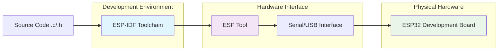
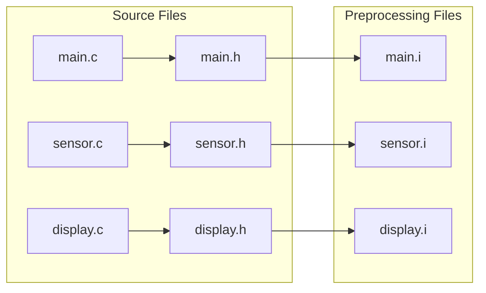
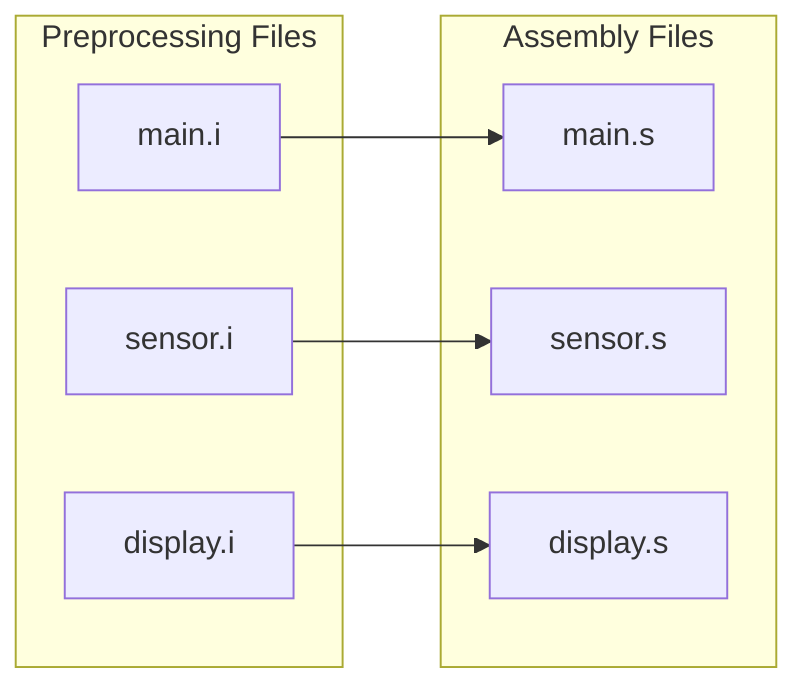
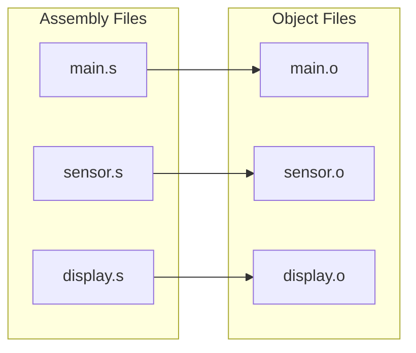
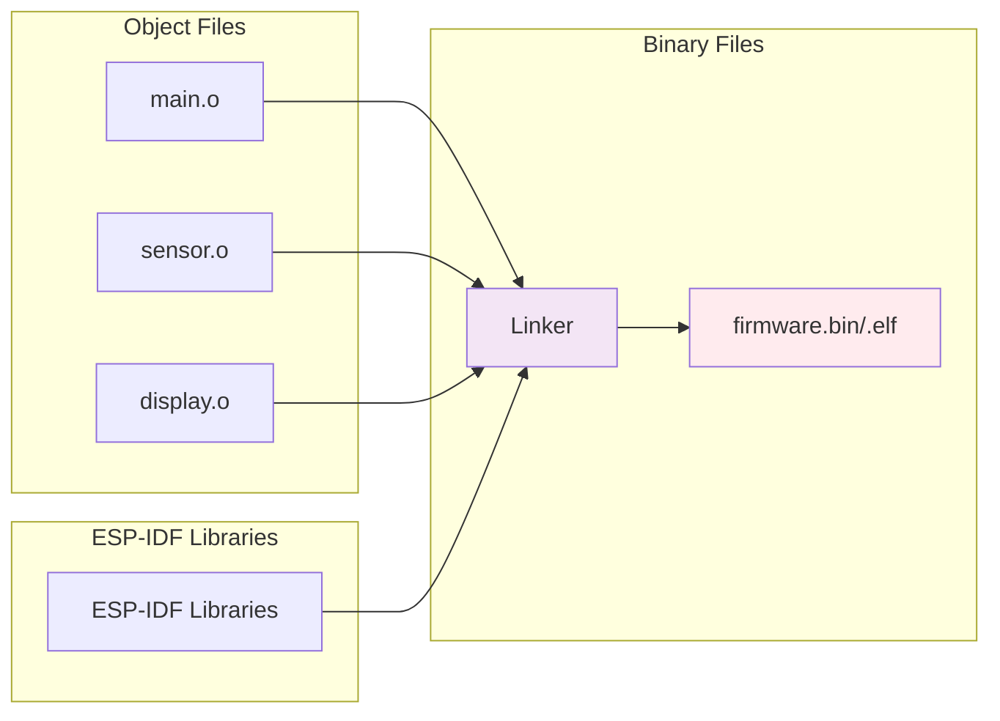
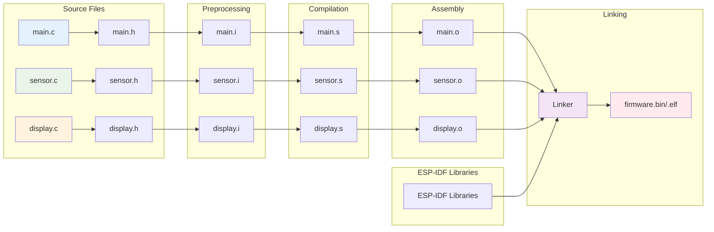
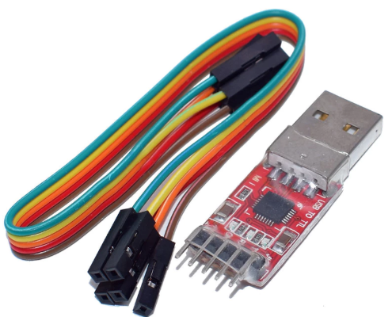
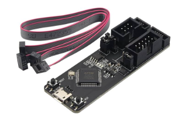
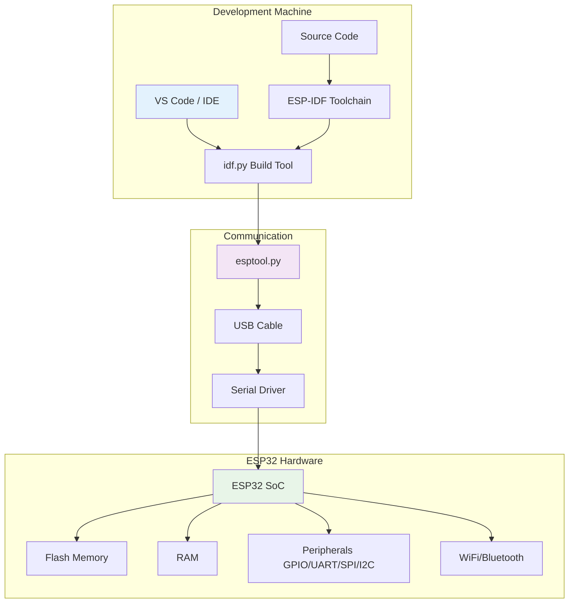

# ระบบการ Build สำหรับ ESP32 Project 

## บทนำ

การพัฒนา Firmware สำหรับ ESP32 ด้วยภาษา C ต้องอาศัยระบบ Build ที่มีประสิทธิภาพ ESP-IDF (Espressif IoT Development Framework) ใช้ CMake เป็น Build System หลัก ซึ่งช่วยจัดการการ compile, link และ deploy code ไปยัง ESP32 development board

## ภาพรวมของ ESP-IDF Build System 

### การทำงานของ Build System 




### ภาพรวมของกระบวนการพัฒนา ESP32 Hardware

ในการพัฒนา firmware สำหรับ ESP32 มีขั้นตอนหลักดังนี้:

1. **การเขียน Source Code**: Developer เขียน source code ในภาษา C/C++ ประกอบด้วยไฟล์ `.c` และ `.h` ที่มีฟังก์ชันต่างๆ สำหรับควบคุม hardware components เช่น GPIO, ADC, UART, WiFi, และ sensors

2. **ระบบ Build Process**: Source code จะถูกนำเข้าสู่ ESP-IDF Build System ซึ่งใช้ CMake ในการจัดการกระบวนการ compilation, linking, และการสร้างไฟล์ binary (.bin/.elf) ที่พร้อมใช้งาน

3. **Hardware Interface**: ไฟล์ binary ที่ได้จากขั้นตอน build จะถูกส่งผ่าน hardware interface (USB-to-Serial converter) โดยใช้เครื่องมือ esptool.py เพื่อเขียนลงใน flash memory ของ ESP32 development board

4. **Deployment & Testing**: หลังจากการ flash เสร็จสิ้น ESP32 จะสามารถทำงานตาม firmware ที่เขียนไว้ และ developer สามารถ monitor การทำงานผ่าน serial communication


## กระบวนการ Build ของ ESP32 toolchain

### ขั้นตอนที่ 1: Preprocessing (การประมวลผลเบื้องต้น)
- **Input**: Source files (.c) + Header files (.h)
- **Process**: 
  - รวม `#include` directives (นำเนื้อหาจาก .h มาใส่ใน .c)
  - ประมวลผล `#define` macros
  - จัดการ conditional compilation (`#ifdef`, `#ifndef`)
  - ลบ comments ออกจากโค้ด
- **Output**: Preprocessed files (.i) - ไฟล์ C ที่ผ่านการประมวลผลแล้ว
- **ตัวอย่าง**: `main.c` + `main.h` → `main.i`

โดยทั่วไป ในโปรเจคของ ESP32 มักจะเขียน souce code ที่รับผิดชอบงานต่างๆ แยกกัน ดังนั้นในขั้นตอนที่ 1 จะมีการประมวลผลเบื้องต้นขนานกันไปในแต่ละ source code

ถ้าโปรเจคเรามี source code  และ include เป็นจำนวนมาก ก็ต้องทำจนครบทุกไฟล์



### ขั้นตอนที่ 2: Compilation (การคอมไพล์)
- **Input**: Preprocessed files (.i)
- **Process**:
  - แปลง C syntax เป็น Assembly language
  - ตรวจสอบ syntax errors
  - ปรับแต่งโค้ดตาม optimization flags
  - สร้าง symbol table
- **Output**: Assembly files (.s) - โค้ดภาษา Assembly
- **ตัวอย่าง**: `main.i` → `main.s`




### ขั้นตอนที่ 3: Assembly (การแปลงเป็นรหัสเครื่อง)
- **Input**: Assembly files (.s)
- **Process**:
  - แปลง Assembly instructions เป็น Machine code
  - สร้าง Object code พร้อม relocation information
  - สร้าง symbol references สำหรับ external functions
- **Output**: Object files (.o) - Machine code ที่ยังไม่ได้ link
- **ตัวอย่าง**: `main.s` → `main.o`



### ขั้นตอนที่ 4: Linking (การเชื่อมโยง)
- **Input**: Object files (.o) + ESP-IDF Libraries + System libraries
- **Process**:
  - รวม Object files ทั้งหมดเข้าด้วยกัน
  - แก้ไข symbol references (function calls ระหว่างไฟล์)
  - จัดระเบียบ memory layout
  - เพิ่ม ESP32 bootloader และ partition information
- **Output**: Executable binary (.bin/.elf) - Firmware พร้อมใช้งาน
- **ตัวอย่าง**: `main.o` + `sensor.o` + `display.o` + ESP-IDF libs → `firmware.bin`




### สรุปการไหลของข้อมูลในกระบวนการ Build:



### ESP32 Development Board และ Toolchain

**ESP-IDF Toolchain (Software)** ได้จัดเตรียมเครื่องมือต่อไปนี้ไว้ให้ตอนติดตั้งโปรแกรม (หรือติดตั้งผ่าน docker)
- Cross-compilation tools สำหรับ Xtensa architecture
- Build system และ configuration tools
- Flash programming utilities
- Debugging และ monitoring tools

**Hardware Interface** 
- USB-to-Serial converter (CP2102, FTDI, CH340)


- Hardware debugging (JTAG)



### Build Process Flow สำหรับ Hardware Development

รายละเอียดของแต่ละขั้นตอนในกระบวนการ Build:

1. **Environment Setup**: ติดตั้ง ESP-IDF และ toolchain
   - ติดตั้ง ESP-IDF framework พร้อม dependencies
   - ติดตั้ง cross-compiler toolchain สำหรับ ESP32 (xtensa-esp32-elf-gcc)
   - ตั้งค่า environment variables (IDF_PATH, PATH)
   - ติดตั้ง Python packages ที่จำเป็น (esptool, idf-tools)

2. **Configuration Phase**: อ่านค่า config จาก sdkconfig
   - โหลดการตั้งค่าจาก sdkconfig.defaults หรือ sdkconfig
   - กำหนดค่า hardware-specific settings (GPIO pins, clock frequency, flash size)
   - เลือก components ที่จะ enable/disable
   - ตั้งค่า memory layout และ partition table

3. **Component Discovery**: ค้นหา components ที่ต้องใช้
   - ค้นหา components ใน ESP-IDF framework (/components)
   - ค้นหา custom components ใน project (/components)
   - ค้นหา managed components จาก ESP Component Registry
   - สร้าง dependency tree ของ components

4. **Dependency Resolution**: แก้ไข dependencies ระหว่าง components
   - วิเคราะห์ REQUIRES และ PRIV_REQUIRES ใน CMakeLists.txt
   - จัดลำดับ compilation ตาม dependency chain
   - ตรวจสอบ circular dependencies
   - เตรียม include paths และ library paths

5. **Cross-Compilation**: compile source files เป็น object files สำหรับ ESP32
   - ใช้ xtensa-esp32-elf-gcc compiler สำหรับ ESP32 architecture
   - แปลง .c/.cpp files เป็น .o files (machine code)
   - ใช้ optimization flags (-O2, -Os) ตาม configuration
   - สร้าง debug symbols หาก enabled

6. **Linking**: รวม object files เป็น executable
   - รวม object files (.o) ทั้งหมดด้วย xtensa-esp32-elf-ld linker
   - เชื่อมโยง ESP-IDF libraries (libfreertos.a, libdriver.a, etc.)
   - จัดระเบียบ memory layout ตาม linker script
   - แก้ไข symbol references ระหว่าง components

7. **Binary Generation**: สร้าง firmware binary files
   - สร้าง .elf file (executable with debug info)
   - แปลง .elf เป็น .bin file (raw binary)
   - สร้าง bootloader.bin และ partition-table.bin
   - คำนวณ checksums และ digital signatures

8. **Flash Programming**: เขียน binary ลง ESP32 flash memory
   - ใช้ esptool.py เพื่อติดต่อกับ ESP32 ผ่าน serial port
   - เขียน bootloader ลง address 0x1000
   - เขียน partition table ลง address 0x8000
   - เขียน application binary ลง address 0x10000

9. **Serial Monitoring**: ติดตาม output ผ่าน serial port
   - เชื่อมต่อกับ ESP32 ผ่าน UART/USB interface
   - รับและแสดง log messages จาก ESP_LOG functions
   - ตรวจสอบ system startup และ runtime behavior
   - Debug และ troubleshoot issues

## สถาปัตยกรรม Development Environment



## การติดตั้ง ESP-IDF Development Environment

### ความต้องการของระบบ

**Windows:**
```powershell
# ติดตั้ง Git
winget install Git.Git

# ติดตั้ง Python 3.8+
winget install Python.Python.3.11

# ติดตั้ง Visual Studio Code
winget install Microsoft.VisualStudioCode
```

**Linux (Ubuntu/Debian):**
```bash
# ติดตั้ง dependencies
sudo apt-get update
sudo apt-get install git wget flex bison gperf python3 python3-pip python3-venv cmake ninja-build ccache libffi-dev libssl-dev dfu-util libusb-1.0-0

# ติดตั้ง VS Code
sudo snap install --classic code
```

### การติดตั้ง ESP-IDF

#### วิธีที่ 1: ESP-IDF Installer (Windows แนะนำ)
```powershell
# ดาวน์โหลดและรัน ESP-IDF installer
# https://dl.espressif.com/dl/esp-idf/

# หรือใช้ VS Code Extension
# ติดตั้ง ESP-IDF extension ใน VS Code
# ใช้ command palette: ESP-IDF: Configure ESP-IDF Extension
```

#### วิธีที่ 2: Manual Installation (Linux/macOS/Windows)
```bash
# Clone ESP-IDF repository
mkdir -p ~/esp
cd ~/esp
git clone --recursive https://github.com/espressif/esp-idf.git

# Switch to stable version
cd esp-idf
git checkout v5.1.2
git submodule update --init --recursive

# Run installation script
./install.sh esp32

# Set up environment variables
. ./export.sh
```

### การกำหนดค่า Environment Variables

**Windows (PowerShell):**
```powershell
# เพิ่มใน PowerShell Profile
$ESP_IDF_PATH = "C:\esp\esp-idf"
$env:IDF_PATH = $ESP_IDF_PATH
$env:PATH += ";$ESP_IDF_PATH\tools"

# หรือใช้ ESP-IDF command prompt
# Start Menu -> ESP-IDF -> ESP-IDF PowerShell
```

**Linux/macOS (Bash):**
```bash
# เพิ่มใน ~/.bashrc หรือ ~/.zshrc
export IDF_PATH=$HOME/esp/esp-idf
source $IDF_PATH/export.sh

# Reload shell
source ~/.bashrc
```

## โครงสร้าง Project สำหรับ Hardware Development

### Project Structure มาตรฐาน

```
my_esp32_project/
├── CMakeLists.txt              # Top-level CMake file
├── sdkconfig                   # Project configuration
├── sdkconfig.defaults          # Default configuration
├── partitions.csv             # Custom partition table (optional)
├── main/                       # Main application
│   ├── CMakeLists.txt         # Main component CMake
│   ├── main.c                 # Entry point
│   └── include/               # Private headers
│       └── main.h
├── components/                 # Custom components
│   └── hardware_driver/
│       ├── CMakeLists.txt
│       ├── hardware_driver.c
│       └── include/
│           └── hardware_driver.h
├── build/                      # Build output (auto-generated)
├── managed_components/         # Package manager components
├── dependencies.lock          # Dependency lock file
└── docs/                       # Documentation
    └── README.md
```

### ไฟล์สำคัญในระบบ Build สำหรับ Hardware

#### 1. Top-level CMakeLists.txt
```cmake
# ตั้งค่า minimum CMake version
cmake_minimum_required(VERSION 3.16)

# Include ESP-IDF build system
include($ENV{IDF_PATH}/tools/cmake/project.cmake)

# กำหนดชื่อ project
project(my_esp32_project)

# เพิ่ม custom configurations สำหรับ hardware
if(CONFIG_HARDWARE_VERSION_V1)
    message(STATUS "Building for Hardware Version 1.0")
    add_compile_definitions(HARDWARE_V1=1)
elseif(CONFIG_HARDWARE_VERSION_V2)
    message(STATUS "Building for Hardware Version 2.0")
    add_compile_definitions(HARDWARE_V2=1)
endif()
```

#### 2. main/CMakeLists.txt
```cmake
# สร้าง component สำหรับ main application
idf_component_register(
    SRCS 
        "main.c" 
        "app_functions.c"
        "hardware_init.c"
    INCLUDE_DIRS 
        "include"
    REQUIRES 
        driver 
        esp_wifi 
        nvs_flash
        esp_netif
        esp_event
        hardware_driver
)

# เพิ่ม hardware-specific definitions
target_compile_definitions(${COMPONENT_LIB} PRIVATE
    HARDWARE_BUILD=1
    APP_VERSION_MAJOR=1
    APP_VERSION_MINOR=0
)
```

#### 3. sdkconfig.defaults (Hardware-specific configuration)
```
# Hardware-specific settings
CONFIG_ESP32_DEFAULT_CPU_FREQ_240=y
CONFIG_ESP32_SPIRAM_SUPPORT=y
CONFIG_SPIRAM_USE_MALLOC=y

# Serial console configuration
CONFIG_ESP_CONSOLE_UART_DEFAULT=y
CONFIG_ESP_CONSOLE_UART_NUM=0
CONFIG_ESP_CONSOLE_UART_BAUDRATE_115200=y

# Flash settings
CONFIG_ESPTOOLPY_FLASHMODE_QIO=y
CONFIG_ESPTOOLPY_FLASHFREQ_80M=y
CONFIG_ESPTOOLPY_FLASHSIZE_4MB=y

# WiFi Configuration
CONFIG_ESP32_WIFI_STATIC_RX_BUFFER_NUM=10
CONFIG_ESP32_WIFI_DYNAMIC_RX_BUFFER_NUM=32
CONFIG_ESP32_WIFI_TX_BUFFER_TYPE_DYNAMIC=y

# FreeRTOS
CONFIG_FREERTOS_HZ=1000
CONFIG_FREERTOS_USE_TRACE_FACILITY=y
CONFIG_FREERTOS_USE_STATS_FORMATTING_FUNCTIONS=y

# Hardware debugging
CONFIG_ESP32_ENABLE_COREDUMP_TO_FLASH=y
CONFIG_ESP32_COREDUMP_DATA_FORMAT_ELF=y
```

#### 4. scripts/flash.sh (Hardware flashing script)
```bash
#!/bin/bash

# ESP32 Hardware flashing script
PROJECT_NAME=${1:-my_esp32_project}
PORT=${2:-/dev/ttyUSB0}  # Linux
# PORT=${2:-COM3}        # Windows

echo "Flashing ESP32 hardware on port $PORT"

# Build project
echo "Building project..."
idf.py build

if [ $? -ne 0 ]; then
    echo "Build failed!"
    exit 1
fi

# Flash to hardware
echo "Flashing to ESP32..."
idf.py -p $PORT flash

# Start monitoring
echo "Starting serial monitor..."
idf.py -p $PORT monitor
```

#### 5. main/main.c (Hardware-specific entry point)
```c
#include <stdio.h>
#include <string.h>
#include "freertos/FreeRTOS.h"
#include "freertos/task.h"
#include "esp_system.h"
#include "esp_wifi.h"
#include "esp_event.h"
#include "esp_log.h"
#include "nvs_flash.h"
#include "driver/gpio.h"
#include "driver/adc.h"
#include "hardware_driver.h"

static const char *TAG = "MAIN";

// Hardware-specific GPIO definitions
#define LED_GPIO_PIN        GPIO_NUM_2
#define BUTTON_GPIO_PIN     GPIO_NUM_0
#define SENSOR_ADC_CHANNEL  ADC1_CHANNEL_0

void hardware_init(void)
{
    ESP_LOGI(TAG, "Initializing hardware components");
    
    // Initialize GPIO
    gpio_config_t led_config = {
        .pin_bit_mask = (1ULL << LED_GPIO_PIN),
        .mode = GPIO_MODE_OUTPUT,
        .pull_up_en = GPIO_PULLUP_DISABLE,
        .pull_down_en = GPIO_PULLDOWN_DISABLE,
        .intr_type = GPIO_INTR_DISABLE
    };
    gpio_config(&led_config);
    
    gpio_config_t button_config = {
        .pin_bit_mask = (1ULL << BUTTON_GPIO_PIN),
        .mode = GPIO_MODE_INPUT,
        .pull_up_en = GPIO_PULLUP_ENABLE,
        .pull_down_en = GPIO_PULLDOWN_DISABLE,
        .intr_type = GPIO_INTR_POSEDGE
    };
    gpio_config(&button_config);
    
    // Initialize ADC
    adc1_config_width(ADC_WIDTH_BIT_12);
    adc1_config_channel_atten(SENSOR_ADC_CHANNEL, ADC_ATTEN_DB_11);
    
    ESP_LOGI(TAG, "Hardware initialization completed");
}

void app_main(void)
{
    ESP_LOGI(TAG, "ESP32 Hardware Application Starting");
    
    // Initialize NVS
    esp_err_t ret = nvs_flash_init();
    if (ret == ESP_ERR_NVS_NO_FREE_PAGES || ret == ESP_ERR_NVS_NEW_VERSION_FOUND) {
        ESP_ERROR_CHECK(nvs_flash_erase());
        ret = nvs_flash_init();
    }
    ESP_ERROR_CHECK(ret);
    
    // Initialize hardware
    hardware_init();
    
    // Initialize custom hardware driver
    ESP_ERROR_CHECK(hardware_driver_init());
    
    ESP_LOGI(TAG, "Application setup completed");
    
    // Main application loop
    while (1) {
        // Read button state
        int button_state = gpio_get_level(BUTTON_GPIO_PIN);
        
        // Control LED based on button
        gpio_set_level(LED_GPIO_PIN, !button_state);
        
        // Read sensor value
        float sensor_value;
        if (hardware_driver_read_sensor(&sensor_value) == ESP_OK) {
            ESP_LOGI(TAG, "Sensor reading: %.2f V", sensor_value);
        }
        
        vTaskDelay(pdMS_TO_TICKS(1000));
    }
}
```

## Build Commands และ Hardware Operations

### การเริ่มต้น Development Environment

```bash
# สำหรับ Windows (ใช้ ESP-IDF command prompt)
# Start Menu -> ESP-IDF -> ESP-IDF PowerShell

# สำหรับ Linux/macOS
source $IDF_PATH/export.sh

# ตรวจสอบการติดตั้ง
idf.py --version
```

### คำสั่ง Build และ Flash พื้นฐาน

```bash
# สร้าง project ใหม่
idf.py create-project my_project

# Configure project
idf.py menuconfig

# Build project
idf.py build

# ค้นหา serial port
# Windows: Device Manager -> Ports (COM & LPT)
# Linux: ls /dev/ttyUSB* หรือ ls /dev/ttyACM*
# macOS: ls /dev/cu.usbserial*

# Flash ไปยัง hardware (ระบุ port)
idf.py -p COM3 flash          # Windows
idf.py -p /dev/ttyUSB0 flash  # Linux
idf.py -p /dev/cu.usbserial-* flash  # macOS

# Monitor serial output
idf.py -p COM3 monitor

# Flash และ monitor รวมกัน
idf.py -p COM3 flash monitor

# แสดงขนาด binary
idf.py size
idf.py size-components
idf.py size-files
```

### การ Configure Hardware-Specific Settings

```bash
# เปิด menuconfig สำหรับ hardware configuration
idf.py menuconfig

# สำคัญ: Hardware-related configurations
# - Serial flasher config -> Flash SPI mode/speed/size
# - Component config -> ESP32-specific -> CPU frequency
# - Component config -> Driver configurations
# - Component config -> WiFi -> WiFi buffer configurations
# - Component config -> FreeRTOS -> Tick rate

# บันทึก config เป็น default
idf.py save-defconfig

# ใช้ config จาก file
idf.py -D SDKCONFIG_DEFAULTS=sdkconfig.hardware reconfigure
```

### Hardware Testing และ Debugging

```bash
# Erase flash memory
idf.py -p COM3 erase-flash

# Flash bootloader อย่างเดียว
idf.py -p COM3 bootloader-flash

# Flash partition table
idf.py -p COM3 partition-table-flash

# Read flash content
esptool.py -p COM3 read_flash 0x0 0x400000 flash_backup.bin

# Monitor แบบ raw (ไม่มี filtering)
idf.py -p COM3 monitor --raw

# ตั้งค่า baud rate สำหรับ monitor
idf.py -p COM3 -b 921600 monitor
```

## Hardware Components และ Driver Development

### การสร้าง Hardware Driver Component

#### components/hardware_driver/CMakeLists.txt
```cmake
# กำหนด source files และ dependencies
idf_component_register(
    SRCS 
        "hardware_driver.c"
        "gpio_driver.c"
        "adc_driver.c"
        "uart_driver.c"
        "spi_driver.c"
        "i2c_driver.c"
    INCLUDE_DIRS 
        "include"
    PRIV_INCLUDE_DIRS
        "private_include"
    REQUIRES 
        driver
        esp_common
        esp_timer
    PRIV_REQUIRES
        spi_flash
        esp_partition
)

# เพิ่ม hardware-specific definitions
target_compile_definitions(${COMPONENT_LIB} PRIVATE
    HARDWARE_DRIVER_VERSION_MAJOR=2
    HARDWARE_DRIVER_VERSION_MINOR=1
    HARDWARE_TARGET_ESP32=1
)

# เพิ่ม compiler flags สำหรับ hardware optimization
target_compile_options(${COMPONENT_LIB} PRIVATE
    -Wall
    -Wextra
    -O2
    -ffunction-sections
    -fdata-sections
)
```

#### components/hardware_driver/include/hardware_driver.h
```c
#ifndef HARDWARE_DRIVER_H
#define HARDWARE_DRIVER_H

#include "esp_err.h"
#include "driver/gpio.h"
#include "driver/adc.h"
#include "driver/uart.h"
#include "driver/spi_master.h"
#include "driver/i2c.h"

#ifdef __cplusplus
extern "C" {
#endif

// Hardware version definitions
typedef enum {
    HARDWARE_VERSION_1_0 = 0,
    HARDWARE_VERSION_2_0,
    HARDWARE_VERSION_MAX
} hardware_version_t;

// GPIO definitions for different hardware versions
typedef struct {
    gpio_num_t led_pin;
    gpio_num_t button_pin;
    gpio_num_t relay_pin;
    adc1_channel_t sensor_adc_channel;
    uart_port_t debug_uart_port;
    gpio_num_t uart_tx_pin;
    gpio_num_t uart_rx_pin;
} hardware_pin_config_t;

/**
 * @brief Initialize hardware driver
 * @param version Hardware version to configure
 * @return ESP_OK on success
 */
esp_err_t hardware_driver_init(hardware_version_t version);

/**
 * @brief Get hardware pin configuration
 * @return Pointer to pin configuration structure
 */
const hardware_pin_config_t* hardware_driver_get_pin_config(void);

/**
 * @brief Read sensor value from ADC
 * @param value Pointer to store sensor value (in volts)
 * @return ESP_OK on success
 */
esp_err_t hardware_driver_read_sensor(float *value);

/**
 * @brief Control LED state
 * @param state true to turn on, false to turn off
 * @return ESP_OK on success
 */
esp_err_t hardware_driver_set_led(bool state);

/**
 * @brief Read button state
 * @param state Pointer to store button state
 * @return ESP_OK on success
 */
esp_err_t hardware_driver_read_button(bool *state);

/**
 * @brief Control relay output
 * @param state true to activate, false to deactivate
 * @return ESP_OK on success
 */
esp_err_t hardware_driver_set_relay(bool state);

/**
 * @brief Initialize UART communication
 * @param baud_rate UART baud rate
 * @return ESP_OK on success
 */
esp_err_t hardware_driver_uart_init(uint32_t baud_rate);

/**
 * @brief Send data via UART
 * @param data Data buffer to send
 * @param length Data length
 * @return ESP_OK on success
 */
esp_err_t hardware_driver_uart_send(const uint8_t *data, size_t length);

/**
 * @brief Receive data via UART
 * @param data Buffer to store received data
 * @param max_length Maximum buffer size
 * @param received_length Pointer to store actual received length
 * @param timeout_ms Timeout in milliseconds
 * @return ESP_OK on success
 */
esp_err_t hardware_driver_uart_receive(uint8_t *data, size_t max_length, 
                                      size_t *received_length, uint32_t timeout_ms);

#ifdef __cplusplus
}
#endif

#endif // HARDWARE_DRIVER_H
```

#### components/hardware_driver/hardware_driver.c
```c
#include "hardware_driver.h"
#include "esp_log.h"
#include "freertos/FreeRTOS.h"
#include "freertos/task.h"

static const char *TAG = "HW_DRIVER";

// Hardware configurations for different versions
static const hardware_pin_config_t hw_v1_config = {
    .led_pin = GPIO_NUM_2,
    .button_pin = GPIO_NUM_0,
    .relay_pin = GPIO_NUM_4,
    .sensor_adc_channel = ADC1_CHANNEL_0,
    .debug_uart_port = UART_NUM_1,
    .uart_tx_pin = GPIO_NUM_17,
    .uart_rx_pin = GPIO_NUM_16
};

static const hardware_pin_config_t hw_v2_config = {
    .led_pin = GPIO_NUM_5,
    .button_pin = GPIO_NUM_0,
    .relay_pin = GPIO_NUM_18,
    .sensor_adc_channel = ADC1_CHANNEL_3,
    .debug_uart_port = UART_NUM_2,
    .uart_tx_pin = GPIO_NUM_17,
    .uart_rx_pin = GPIO_NUM_16
};

static hardware_version_t current_hw_version = HARDWARE_VERSION_1_0;
static const hardware_pin_config_t *pin_config = &hw_v1_config;
static bool driver_initialized = false;

esp_err_t hardware_driver_init(hardware_version_t version)
{
    ESP_LOGI(TAG, "Initializing hardware driver v%d.%d for hardware version %d", 
             HARDWARE_DRIVER_VERSION_MAJOR, HARDWARE_DRIVER_VERSION_MINOR, version);
    
    if (version >= HARDWARE_VERSION_MAX) {
        ESP_LOGE(TAG, "Invalid hardware version: %d", version);
        return ESP_ERR_INVALID_ARG;
    }
    
    current_hw_version = version;
    
    // Select pin configuration based on hardware version
    switch (version) {
        case HARDWARE_VERSION_1_0:
            pin_config = &hw_v1_config;
            break;
        case HARDWARE_VERSION_2_0:
            pin_config = &hw_v2_config;
            break;
        default:
            ESP_LOGE(TAG, "Unsupported hardware version");
            return ESP_ERR_NOT_SUPPORTED;
    }
    
    // Initialize GPIO for LED
    gpio_config_t led_config = {
        .pin_bit_mask = (1ULL << pin_config->led_pin),
        .mode = GPIO_MODE_OUTPUT,
        .pull_up_en = GPIO_PULLUP_DISABLE,
        .pull_down_en = GPIO_PULLDOWN_DISABLE,
        .intr_type = GPIO_INTR_DISABLE
    };
    ESP_ERROR_CHECK(gpio_config(&led_config));
    
    // Initialize GPIO for button
    gpio_config_t button_config = {
        .pin_bit_mask = (1ULL << pin_config->button_pin),
        .mode = GPIO_MODE_INPUT,
        .pull_up_en = GPIO_PULLUP_ENABLE,
        .pull_down_en = GPIO_PULLDOWN_DISABLE,
        .intr_type = GPIO_INTR_DISABLE
    };
    ESP_ERROR_CHECK(gpio_config(&button_config));
    
    // Initialize GPIO for relay
    gpio_config_t relay_config = {
        .pin_bit_mask = (1ULL << pin_config->relay_pin),
        .mode = GPIO_MODE_OUTPUT,
        .pull_up_en = GPIO_PULLUP_DISABLE,
        .pull_down_en = GPIO_PULLDOWN_DISABLE,
        .intr_type = GPIO_INTR_DISABLE
    };
    ESP_ERROR_CHECK(gpio_config(&relay_config));
    
    // Initialize ADC
    adc1_config_width(ADC_WIDTH_BIT_12);
    adc1_config_channel_atten(pin_config->sensor_adc_channel, ADC_ATTEN_DB_11);
    
    // Turn off LED and relay initially
    gpio_set_level(pin_config->led_pin, 0);
    gpio_set_level(pin_config->relay_pin, 0);
    
    driver_initialized = true;
    ESP_LOGI(TAG, "Hardware driver initialization completed for version %d", version);
    
    return ESP_OK;
}

const hardware_pin_config_t* hardware_driver_get_pin_config(void)
{
    return pin_config;
}

esp_err_t hardware_driver_read_sensor(float *value)
{
    if (!driver_initialized) {
        return ESP_ERR_INVALID_STATE;
    }
    
    if (value == NULL) {
        return ESP_ERR_INVALID_ARG;
    }
    
    int raw_value = adc1_get_raw(pin_config->sensor_adc_channel);
    *value = (float)raw_value * 3.3f / 4095.0f; // Convert to voltage
    
    ESP_LOGD(TAG, "Sensor raw: %d, voltage: %.3f V", raw_value, *value);
    return ESP_OK;
}

esp_err_t hardware_driver_set_led(bool state)
{
    if (!driver_initialized) {
        return ESP_ERR_INVALID_STATE;
    }
    
    gpio_set_level(pin_config->led_pin, state ? 1 : 0);
    ESP_LOGD(TAG, "LED set to %s", state ? "ON" : "OFF");
    return ESP_OK;
}

esp_err_t hardware_driver_read_button(bool *state)
{
    if (!driver_initialized) {
        return ESP_ERR_INVALID_STATE;
    }
    
    if (state == NULL) {
        return ESP_ERR_INVALID_ARG;
    }
    
    *state = !gpio_get_level(pin_config->button_pin); // Inverted due to pull-up
    return ESP_OK;
}

esp_err_t hardware_driver_set_relay(bool state)
{
    if (!driver_initialized) {
        return ESP_ERR_INVALID_STATE;
    }
    
    gpio_set_level(pin_config->relay_pin, state ? 1 : 0);
    ESP_LOGI(TAG, "Relay %s", state ? "activated" : "deactivated");
    return ESP_OK;
}

esp_err_t hardware_driver_uart_init(uint32_t baud_rate)
{
    if (!driver_initialized) {
        return ESP_ERR_INVALID_STATE;
    }
    
    uart_config_t uart_config = {
        .baud_rate = baud_rate,
        .data_bits = UART_DATA_8_BITS,
        .parity = UART_PARITY_DISABLE,
        .stop_bits = UART_STOP_BITS_1,
        .flow_ctrl = UART_HW_FLOWCTRL_DISABLE,
        .source_clk = UART_SCLK_DEFAULT,
    };
    
    ESP_ERROR_CHECK(uart_driver_install(pin_config->debug_uart_port, 1024, 1024, 0, NULL, 0));
    ESP_ERROR_CHECK(uart_param_config(pin_config->debug_uart_port, &uart_config));
    ESP_ERROR_CHECK(uart_set_pin(pin_config->debug_uart_port, 
                                pin_config->uart_tx_pin, 
                                pin_config->uart_rx_pin, 
                                UART_PIN_NO_CHANGE, 
                                UART_PIN_NO_CHANGE));
    
    ESP_LOGI(TAG, "UART initialized on port %d, baud rate: %lu", 
             pin_config->debug_uart_port, baud_rate);
    return ESP_OK;
}

esp_err_t hardware_driver_uart_send(const uint8_t *data, size_t length)
{
    if (!driver_initialized) {
        return ESP_ERR_INVALID_STATE;
    }
    
    if (data == NULL || length == 0) {
        return ESP_ERR_INVALID_ARG;
    }
    
    int bytes_sent = uart_write_bytes(pin_config->debug_uart_port, data, length);
    if (bytes_sent < 0) {
        ESP_LOGE(TAG, "UART send failed");
        return ESP_FAIL;
    }
    
    ESP_LOGD(TAG, "UART sent %d bytes", bytes_sent);
    return ESP_OK;
}

esp_err_t hardware_driver_uart_receive(uint8_t *data, size_t max_length, 
                                      size_t *received_length, uint32_t timeout_ms)
{
    if (!driver_initialized) {
        return ESP_ERR_INVALID_STATE;
    }
    
    if (data == NULL || received_length == NULL) {
        return ESP_ERR_INVALID_ARG;
    }
    
    int bytes_received = uart_read_bytes(pin_config->debug_uart_port, 
                                       data, max_length, 
                                       pdMS_TO_TICKS(timeout_ms));
    
    if (bytes_received < 0) {
        ESP_LOGE(TAG, "UART receive failed");
        return ESP_FAIL;
    }
    
    *received_length = bytes_received;
    ESP_LOGD(TAG, "UART received %d bytes", bytes_received);
    return ESP_OK;
}
```

## Hardware Configuration Management

### การใช้งาน menuconfig สำหรับ Hardware

```bash
# เปิด menuconfig
idf.py menuconfig

# หัวข้อสำคัญสำหรับ hardware:
# 1. Serial flasher config
#    - Flash SPI mode (QIO/QOUT/DIO/DOUT)
#    - Flash SPI speed (80MHz/40MHz/26MHz/20MHz)
#    - Flash size (1MB/2MB/4MB/8MB/16MB)
#    - Detect flash size when flashing bootloader

# 2. Partition Table
#    - Single factory app (large), no OTA
#    - Factory app, two OTA definitions
#    - Custom partition table CSV

# 3. Compiler options
#    - Optimization Level (-Os/-O0/-O1/-O2/-O3)
#    - Assertion level
#    - C++ exceptions

# 4. Component config -> ESP32-specific
#    - CPU frequency (80MHz/160MHz/240MHz)
#    - Enable SPIRAM support
#    - SPIRAM configuration

# 5. Component config -> Driver configurations
#    - UART configuration
#    - SPI configuration
#    - I2C configuration
#    - ADC configuration
#    - GPIO configuration

# 6. Component config -> Wi-Fi
#    - WiFi buffer configurations
#    - Power save mode
#    - WiFi NVS flash

# บันทึก configuration
idf.py save-defconfig
```

### การสร้าง Hardware-Specific Kconfig

#### components/hardware_driver/Kconfig
```kconfig
menu "Hardware Driver Configuration"

    choice HARDWARE_VERSION
        prompt "Hardware Version"
        default HARDWARE_VERSION_V1
        help
            Select the target hardware version.

        config HARDWARE_VERSION_V1
            bool "Hardware Version 1.0"
        config HARDWARE_VERSION_V2
            bool "Hardware Version 2.0"
    endchoice

    config HARDWARE_LED_GPIO
        int "LED GPIO Pin"
        range 0 39
        default 2 if HARDWARE_VERSION_V1
        default 5 if HARDWARE_VERSION_V2
        help
            GPIO pin number for LED control.

    config HARDWARE_BUTTON_GPIO
        int "Button GPIO Pin"
        range 0 39
        default 0
        help
            GPIO pin number for button input.

    config HARDWARE_RELAY_GPIO
        int "Relay GPIO Pin"
        range 0 39
        default 4 if HARDWARE_VERSION_V1
        default 18 if HARDWARE_VERSION_V2
        help
            GPIO pin number for relay control.

    config HARDWARE_ADC_CHANNEL
        int "ADC Channel for Sensor"
        range 0 7
        default 0 if HARDWARE_VERSION_V1
        default 3 if HARDWARE_VERSION_V2
        help
            ADC channel for sensor reading.

    config HARDWARE_UART_PORT
        int "Debug UART Port"
        range 0 2
        default 1 if HARDWARE_VERSION_V1
        default 2 if HARDWARE_VERSION_V2
        help
            UART port number for debug communication.

    config HARDWARE_ENABLE_WATCHDOG
        bool "Enable Hardware Watchdog"
        default y
        help
            Enable hardware watchdog timer for system reliability.

    config HARDWARE_SENSOR_CALIBRATION
        bool "Enable Sensor Calibration"
        default y
        help
            Enable automatic sensor calibration on startup.

    config HARDWARE_DEBUG_LOGGING
        bool "Enable Hardware Debug Logging"
        default n
        help
            Enable detailed debug logging for hardware operations.

endmenu
```

## Debugging และ Hardware Analysis

### การใช้งาน Serial Monitor

```bash
# Basic monitoring
idf.py -p COM3 monitor

# Monitor พร้อมกำหนด baud rate
idf.py -p COM3 -b 921600 monitor

# Monitor แบบ raw output (ไม่มี timestamp)
idf.py -p COM3 monitor --raw

# Monitor พร้อม log level filtering
idf.py -p COM3 monitor --print_filter "*:I"  # Info level และสูงกว่า

# การใช้ keyboard shortcuts ใน monitor:
# Ctrl+] - ออกจาก monitor
# Ctrl+T Ctrl+R - Reset ESP32
# Ctrl+T Ctrl+F - Flash และ reset
# Ctrl+T Ctrl+A - สลับ timestamps
# Ctrl+T Ctrl+L - สลับ log colors
```

### การใช้งาน JTAG Debugging (สำหรับ Advanced Hardware Debug)

```bash
# ต้องการ JTAG adapter (เช่น ESP-Prog, J-Link)
# การเชื่อมต่อ JTAG pins บน ESP32:
# TDI -> GPIO12
# TDO -> GPIO15
# TCK -> GPIO13
# TMS -> GPIO14

# เริ่ม OpenOCD server
idf.py openocd

# เชื่อมต่อ GDB (terminal ใหม่)
idf.py gdb

# GDB commands สำหรับ hardware debugging
(gdb) monitor reset halt
(gdb) break app_main
(gdb) continue
(gdb) info registers
(gdb) print gpio_get_level(2)
(gdb) watch sensor_value
(gdb) backtrace
```

### การวิเคราะห์ Memory Usage บน Hardware

```bash
# แสดงการใช้ memory
idf.py size

# แสดงรายละเอียดตาม component
idf.py size-components

# แสดงรายละเอียดตาม source file
idf.py size-files

# สร้าง memory map file
idf.py build
# ดูไฟล์ build/*.map สำหรับรายละเอียด memory layout

# ดู coredump จาก hardware (หาก enable)
idf.py coredump-info build/my_project.elf /path/to/coredump
idf.py coredump-debug build/my_project.elf /path/to/coredump
```

### Hardware Performance Monitoring

```c
// ตัวอย่างการ monitor performance บน hardware
#include "esp_timer.h"
#include "esp_heap_caps.h"

void monitor_system_performance(void)
{
    // Monitor heap memory
    size_t free_heap = esp_get_free_heap_size();
    size_t min_free_heap = esp_get_minimum_free_heap_size();
    
    ESP_LOGI("PERF", "Free heap: %u bytes, Min free: %u bytes", 
             free_heap, min_free_heap);
    
    // Monitor PSRAM (if available)
    size_t free_psram = heap_caps_get_free_size(MALLOC_CAP_SPIRAM);
    ESP_LOGI("PERF", "Free PSRAM: %u bytes", free_psram);
    
    // Monitor CPU frequency
    rtc_cpu_freq_config_t freq_config;
    rtc_clk_cpu_freq_get_config(&freq_config);
    ESP_LOGI("PERF", "CPU frequency: %u MHz", freq_config.freq_mhz);
    
    // Monitor uptime
    int64_t uptime_us = esp_timer_get_time();
    ESP_LOGI("PERF", "Uptime: %lld ms", uptime_us / 1000);
}
```

## Hardware Testing และ Validation

### Unit Testing บน Hardware

#### test/test_hardware_driver.c
```c
#include "unity.h"
#include "hardware_driver.h"
#include "esp_log.h"
#include "freertos/FreeRTOS.h"
#include "freertos/task.h"

static const char *TAG = "TEST_HW";

void setUp(void)
{
    ESP_LOGI(TAG, "Setting up hardware driver test");
    TEST_ASSERT_EQUAL(ESP_OK, hardware_driver_init(HARDWARE_VERSION_1_0));
}

void tearDown(void)
{
    ESP_LOGI(TAG, "Tearing down hardware driver test");
}

void test_hardware_driver_init(void)
{
    esp_err_t ret = hardware_driver_init(HARDWARE_VERSION_1_0);
    TEST_ASSERT_EQUAL(ESP_OK, ret);
    
    // Test invalid version
    ret = hardware_driver_init(HARDWARE_VERSION_MAX);
    TEST_ASSERT_EQUAL(ESP_ERR_INVALID_ARG, ret);
}

void test_led_control(void)
{
    // Test LED on
    esp_err_t ret = hardware_driver_set_led(true);
    TEST_ASSERT_EQUAL(ESP_OK, ret);
    
    vTaskDelay(pdMS_TO_TICKS(500)); // Visual verification
    
    // Test LED off
    ret = hardware_driver_set_led(false);
    TEST_ASSERT_EQUAL(ESP_OK, ret);
    
    ESP_LOGI(TAG, "LED control test completed");
}

void test_button_reading(void)
{
    bool button_state;
    esp_err_t ret = hardware_driver_read_button(&button_state);
    TEST_ASSERT_EQUAL(ESP_OK, ret);
    
    ESP_LOGI(TAG, "Button state: %s", button_state ? "PRESSED" : "RELEASED");
    
    // Test invalid parameter
    ret = hardware_driver_read_button(NULL);
    TEST_ASSERT_EQUAL(ESP_ERR_INVALID_ARG, ret);
}

void test_sensor_reading(void)
{
    float sensor_value;
    esp_err_t ret = hardware_driver_read_sensor(&sensor_value);
    TEST_ASSERT_EQUAL(ESP_OK, ret);
    
    // Validate sensor reading range (0-3.3V)
    TEST_ASSERT_TRUE(sensor_value >= 0.0f && sensor_value <= 3.3f);
    
    ESP_LOGI(TAG, "Sensor reading: %.3f V", sensor_value);
    
    // Test invalid parameter
    ret = hardware_driver_read_sensor(NULL);
    TEST_ASSERT_EQUAL(ESP_ERR_INVALID_ARG, ret);
}

void test_relay_control(void)
{
    // Test relay activation
    esp_err_t ret = hardware_driver_set_relay(true);
    TEST_ASSERT_EQUAL(ESP_OK, ret);
    
    vTaskDelay(pdMS_TO_TICKS(1000)); // Allow relay to activate
    
    // Test relay deactivation
    ret = hardware_driver_set_relay(false);
    TEST_ASSERT_EQUAL(ESP_OK, ret);
    
    ESP_LOGI(TAG, "Relay control test completed");
}

void test_uart_communication(void)
{
    // Initialize UART
    esp_err_t ret = hardware_driver_uart_init(115200);
    TEST_ASSERT_EQUAL(ESP_OK, ret);
    
    // Test UART send
    const char *test_data = "Hello, UART!\n";
    ret = hardware_driver_uart_send((uint8_t*)test_data, strlen(test_data));
    TEST_ASSERT_EQUAL(ESP_OK, ret);
    
    // Test UART receive (with timeout)
    uint8_t rx_buffer[64];
    size_t received_length;
    ret = hardware_driver_uart_receive(rx_buffer, sizeof(rx_buffer), 
                                     &received_length, 100);
    // Note: This might timeout if no data is available, which is normal
    
    ESP_LOGI(TAG, "UART test completed, received %u bytes", received_length);
}

void app_main(void)
{
    ESP_LOGI(TAG, "Starting hardware driver unit tests");
    
    // Wait for system to stabilize
    vTaskDelay(pdMS_TO_TICKS(2000));
    
    UNITY_BEGIN();
    
    RUN_TEST(test_hardware_driver_init);
    RUN_TEST(test_led_control);
    RUN_TEST(test_button_reading);
    RUN_TEST(test_sensor_reading);
    RUN_TEST(test_relay_control);
    RUN_TEST(test_uart_communication);
    
    UNITY_END();
    
    ESP_LOGI(TAG, "All hardware tests completed");
}
```

### Integration Testing Script

#### scripts/hardware-test.sh
```bash
#!/bin/bash

# Hardware integration testing script
PORT=${1:-/dev/ttyUSB0}
PROJECT_NAME="hardware_test"

echo "Starting ESP32 hardware integration testing on $PORT"

# Build test project
echo "Building test project..."
idf.py build

if [ $? -ne 0 ]; then
    echo "Build failed!"
    exit 1
fi

# Flash test firmware
echo "Flashing test firmware..."
idf.py -p $PORT flash

# Run tests and capture output
echo "Running hardware tests..."
timeout 60s idf.py -p $PORT monitor > test_results.log 2>&1

# Analyze test results
if grep -q "Tests:.*Failures:.*Ignored:" test_results.log; then
    echo "Unity test results found:"
    grep "Tests:.*Failures:.*Ignored:" test_results.log
    
    if grep -q "Failures: 0" test_results.log; then
        echo "All hardware tests PASSED!"
        exit 0
    else
        echo "Some hardware tests FAILED!"
        echo "Check test_results.log for details"
        exit 1
    fi
else
    echo "No test results found. Check test_results.log"
    exit 1
fi
```

## Production และ Deployment

### การเตรียม Firmware สำหรับ Production

```bash
# Build สำหรับ production (optimize for size)
idf.py menuconfig
# Component config -> Compiler options -> Optimization Level -> Optimize for size (-Os)
# Component config -> Log output -> Default log verbosity -> No output

# Build production firmware
idf.py build

# สร้าง single binary file สำหรับ production flashing
esptool.py --chip esp32 merge_bin -o production_firmware.bin \
    --flash_mode dio \
    --flash_freq 40m \
    --flash_size 4MB \
    0x1000 build/bootloader/bootloader.bin \
    0x10000 build/my_project.bin \
    0x8000 build/partition_table/partition-table.bin

# ตรวจสอบขนาด production firmware
ls -lh production_firmware.bin
```

### Mass Production Flashing

```bash
# Script สำหรับ mass production flashing
#!/bin/bash

FIRMWARE_FILE="production_firmware.bin"
LOG_DIR="flash_logs"

mkdir -p $LOG_DIR

echo "Starting mass production flashing..."

for PORT in /dev/ttyUSB*; do
    if [ -e "$PORT" ]; then
        TIMESTAMP=$(date +%Y%m%d_%H%M%S)
        SERIAL=$(basename $PORT)
        LOG_FILE="$LOG_DIR/flash_${SERIAL}_${TIMESTAMP}.log"
        
        echo "Flashing device on $PORT..."
        
        # Erase flash
        esptool.py -p $PORT erase_flash >> $LOG_FILE 2>&1
        
        # Flash firmware
        esptool.py -p $PORT -b 921600 write_flash 0x0 $FIRMWARE_FILE >> $LOG_FILE 2>&1
        
        if [ $? -eq 0 ]; then
            echo "Device on $PORT flashed successfully"
        else
            echo "Device on $PORT flash FAILED - check $LOG_FILE"
        fi
    fi
done

echo "Mass production flashing completed"
```

## Best Practices สำหรับ Hardware Development

### 1. Project Organization
- แยก hardware-specific code ใน dedicated components
- ใช้ version control สำหรับ hardware configurations
- Document hardware dependencies และ pin assignments
- ใช้ consistent naming conventions

### 2. Hardware Abstraction
- สร้าง Hardware Abstraction Layer (HAL)
- Support multiple hardware versions ใน codebase เดียว
- ใช้ configuration files สำหรับ different hardware variants
- Isolate hardware-specific code จาก application logic

### 3. Testing Strategy
- ทำ unit tests บน actual hardware
- ใช้ automated testing scripts
- Document test procedures และ expected results
- Validate บน different hardware batches

### 4. Debugging และ Development
- ใช้ appropriate logging levels สำหรับ production
- Setup efficient debugging workflow
- Monitor hardware performance metrics
- Document common hardware issues และ solutions

### 5. Production Considerations
- Optimize binary size สำหรับ production
- ใช้ OTA updates สำหรับ field deployment
- Implement hardware health monitoring
- Plan for hardware lifecycle management

## Troubleshooting Common Hardware Issues

### Serial Connection Problems
```bash
# ตรวจสอบ serial port
ls /dev/ttyUSB*  # Linux
ls /dev/ttyACM*  # Linux alternative
ls /dev/cu.*     # macOS

# Windows - ใช้ Device Manager หรือ:
wmic path Win32_SerialPort get Name,DeviceID

# Permission issues (Linux)
sudo chmod 666 /dev/ttyUSB0
# หรือเพิ่ม user เข้า dialout group
sudo usermod -a -G dialout $USER

# Driver issues
# Windows: ติดตั้ง CP2102/CH340/FTDI drivers
# Linux: โดยปกติมี drivers built-in
```

### Flash Issues
```bash
# Flash detection failed
esptool.py -p COM3 flash_id

# Corrupted flash
esptool.py -p COM3 erase_flash

# Boot loop / crash on startup
idf.py -p COM3 monitor --print_filter "*:E"  # ดู error messages

# Flash size mismatch
idf.py menuconfig  # Serial flasher config -> Flash size
```

### Hardware-Specific Issues
```bash
# GPIO not working
# - ตรวจสอบ pin configuration
# - ดู schematic สำหรับ pin conflicts
# - ตรวจสอบ pull-up/pull-down settings

# ADC reading unstable
# - เพิ่ม hardware filtering
# - ใช้ multiple samples และ averaging
# - ตรวจสอบ reference voltage

# UART communication problems
# - ตรวจสอบ baud rate
# - ตรวจสอบ TX/RX pin connections
# - ดู signal levels ด้วย oscilloscope

# Power supply issues
# - ตรวจสอบ voltage levels (3.3V)
# - ดู current consumption
# - ตรวจสอบ decoupling capacitors
```

## สรุป

การพัฒนา ESP32 firmware สำหรับ hardware จริงให้ประโยชน์และข้อพิจารณาดังนี้:

**ข้อดี:**
- Performance และ timing ที่แม่นยำ
- การทดสอบกับ peripherals จริง
- Real-world validation
- Production-ready development
- Hardware-in-the-loop testing

**ข้อพิจารณา:**
- ต้องมี hardware development boards
- Setup environment ที่ซับซ้อนกว่า
- Debugging อาจยากกว่า
- ต้องจัดการ hardware variations
- Physical access requirements

การเข้าใจ ESP-IDF Build System สำหรับ hardware development จะช่วยให้สามารถพัฒนา firmware ที่มีคุณภาพและพร้อมสำหรับการใช้งานจริงได้อย่างมีประสิทธิภาพ การใช้ tools และ practices ที่เหมาะสมจะช่วยลดปัญหาในการพัฒนาและเพิ่มความน่าเชื่อถือของระบบ
